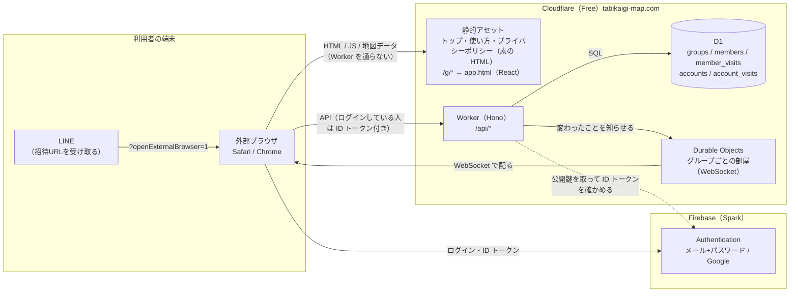

# システム構成

状態：下書き（2026-10-10：[ADR 0003](../adr/0003-backend-selection.md) が案 C に決まったので、Firebase 一式の版から書き直した。元の版は git の履歴にある。画面の作り方は [ADR 0004](../adr/0004-frontend-react-typescript.md)。システム構成図の清書（draw.io）は roadmap の Phase 1 で作る）

## 構成図



- 画面は静的なファイルとして Cloudflare から配る。**`/api/*` だけを Worker が受ける**（`run_worker_first`）。招待URL `/g/*` は `_redirects` の 200 リライトで `app.html` を返し、Worker を通らない（Worker の枠が尽きても画面は出る。2026-10-05 に本番で確認：[ADR 0003](../adr/0003-backend-selection.md) の決定の基準1）
- データの正本は D1 の1か所。読み書きはすべて API を通す。画面から D1 に直接は触れない。データの形は [data-model.md](data-model.md)
- **アクセス制御（NFR-006）は API とデータベースの制約で行う**。どこで何を守るかは [data-model.md](data-model.md) の「保存先で守るもの」
- リアルタイム（NFR-003）：API が D1 に書けたら、グループの部屋に知らせ、部屋が開いている画面に WebSocket で配る。部屋はデータを持たない（[ADR 0003](../adr/0003-backend-selection.md) の「リアルタイムの共有」）
- 地図の形（47都道府県の SVG パス）は、ビルド時に画面へ埋め込む静的データ（`tools/paths.json`）。DB には入れない

## 使うサービス

| サービス | 役割 | 無料枠と、超えたとき |
|---|---|---|
| Cloudflare 静的アセット | 画面の配信、`/g/*` のリライト、`_headers` で `noindex` | 無料・無制限。Worker の回数に数えない（2026-10-05 に本番で確認） |
| Cloudflare Workers | API（Hono） | 1日10万リクエスト、1回の CPU 10ms。超えたらエラーで止まり、日本時間9時に戻る |
| Cloudflare D1 | データ（SQLite） | 1日に読み取り500万行・書き込み10万行、1データベース500MB、1回の呼び出しで SQL 50本まで。超えたらエラーで止まり、日本時間9時に戻る |
| Cloudflare Durable Objects | リアルタイムの部屋 | Free は SQLite 版だけ。1日10万リクエスト（WebSocket の受信は20通で1）。超えたらエラーで止まる |
| Firebase Authentication（Spark） | メール＋パスワード、Google。確認メールとパスワードの再設定のメール | 5万 MAU。確認メール 1,000通/日、パスワードの再設定 150通/日 |
| Cloudflare Turnstile | ボット対策（グループの作成、参加、問い合わせ） | 無料・回数無制限（ADR 0003） |
| Cloudflare Registrar | ドメイン `tabikaigi-map.com` | 年額の固定費（2027-10-04 まで、自動更新） |

どれも Free のまま使い、有料プランには上げない。Cloudflare で触らない製品と操作（R2 の有効化など）は [ADR 0003](../adr/0003-backend-selection.md) の「C で Cloudflare 側を守る決まり」。

出典：[ADR 0003](../adr/0003-backend-selection.md) の「出典」、https://developers.cloudflare.com/workers/platform/pricing/ 、https://developers.cloudflare.com/d1/platform/pricing/ 、https://developers.cloudflare.com/d1/platform/limits/ 、https://developers.cloudflare.com/durable-objects/platform/pricing/ 、https://firebase.google.com/docs/auth/limits

### 無料枠を超えたとき（NFR-009・NFR-012）

API の枠（Workers・D1）が尽きると、その日は「行った」を保存できなくなる。画面は API の応答が JSON の 503 でも、JSON でない応答（Cloudflare のエラー画面）でも「いまは使えない」を出し、付け外しを送らない（2026-10-10 にローカルで確認：[ADR 0003](../adr/0003-backend-selection.md) の決定の基準3）。画面そのもの（静的アセット）は出続ける。

Durable Objects の枠が尽きたら、リアルタイムだけが止まり、開き直したときに反映される形に戻る（NFR-003）。

### 部屋が配るもの（NFR-003）

部屋は、API が D1 に書けた後に知らせを受けて、そのグループの画面を開いている全員に配る。配るのは次の3つだけ（[ADR 0003](../adr/0003-backend-selection.md) の「リアルタイムの共有」）。

| 種類 | 中身 | いつ |
|---|---|---|
| 「行った」の付け外し | メンバーの番号、県の番号、付けたか外したか | ログインなしのメンバーの付け外し。ログインしている人の付け外しは、紐づいたメンバーがいる全グループの部屋に、それぞれのグループでのメンバーの番号を付けて配る |
| 取り直して | なし | 紐づけで、そのメンバーの「行った」がアカウントのものに入れ替わったとき |
| （配らない） | — | 参加、退出、名前の変更、グループ名の変更。画面は、知らないメンバーの変更が届いたときと、画面に戻ったときに全体を取り直す |

画面が受け取った「取り直して」と、知らないメンバーの変更は、どちらもグループを読み直す（読み取りは1回分）。

## 運用

運営者1人で回せる形にする（NFR-014）。確かめる場所は Cloudflare の管理画面と Firebase のコンソールの2つ。

| 何を | どうやって | 要件・未決 |
|---|---|---|
| バックアップ | 新しい版を出す前に `wrangler d1 export` で全データを手元に書き出す。書き出しの間はほかの読み書きが止まる（要確認）ので、使われない時間に行う | NFR-017 |
| 消したデータの残り方 | D1 の Time Travel は常に有効で、消したデータも7日間は戻せる状態で残る（Free。復元は10分に10回まで）。プライバシーポリシーの保存期間に書く | NFR-008 |
| 利用状況 | D1 に SQL を流して数える（グループ数、メンバー数）。「最近使われた」の数え方は Q-025 | NFR-010 |
| 使用量 | 週1回、Cloudflare の管理画面と Firebase のコンソールで見る。Cron Triggers で自動の知らせを作れるかは Phase 2 | NFR-011、Q-026 |
| エラー | Workers Logs（有効にするか、残す範囲は Q-027） | NFR-013 |
| 使い切られる対策 | グループの作成と参加の API に Turnstile（無料）。`/api/*` のレート制限、ファイルがない URL の静的な 404、部屋への接続の回数の制限は Phase 2 | Q-031 |
| 問い合わせ | アプリの中のフォーム（API＋D1＋Turnstile）。表の形は Phase 2 | NFR-018 |
| D1 の置き場所 | 作るときにアジアを指定する（後から変えられない：要確認） | NFR-016 |

出典：https://developers.cloudflare.com/d1/reference/time-travel/ 、https://developers.cloudflare.com/d1/platform/limits/ 、[ADR 0003](../adr/0003-backend-selection.md) の「運用」

## 認証の方針

- **ログインする人だけ** Firebase Authentication を使う。ログインなしの人は匿名ログインもせず、証明書なしで API を使う（ADR 0003。理由：案 C ではログインなしの人の `uid` を持たないので、匿名ログインの利点がない）
- ログインしている人は、API を呼ぶたびに ID トークン（Firebase の証明書）を `Authorization` ヘッダーで送る。Worker は Google の公開鍵で署名を確かめ、`aud`・`iss` がプロジェクトID `tabikaigi-map` と合うかを見る（2026-10-10 に本物の証明書でローカルで確認：決定の基準2）
- メールアドレスの確認が済んでいない人（`email_verified` が false）は、ログインありとして扱わない（NFR-006 (10)）
- Google ログインはポップアップ方式（`signInWithPopup`）。画面のドメインと Firebase の認証のドメインが違ってもブラウザで動くため（[ADR 0003](../adr/0003-backend-selection.md) の「招待URLとドメイン」）
- 流れは [auth-flow.md](auth-flow.md)

### 招待URLのプレビュー（OGP）
- 全グループ共通の固定の OGP にする
- LINE のクローラーは JavaScript を実行しないので、固定の `og:title`・`og:description`・`og:image` を HTML に直接書く
- グループ名を出すのは MVP ではやらない（requirements の「やらないこと」）

### 検索に出すページと出さないページ（NFR-019、NFR-005）

| | 検索に出すページ（トップ、使い方、プライバシーポリシー） | アプリの画面（`/g/*` など） |
|---|---|---|
| 作り方 | 中身を書いた素の HTML（[ADR 0004](../adr/0004-frontend-react-typescript.md)） | React の画面（`app.html` から動く） |
| `noindex` | 付けない | **付ける**。`_headers` でレスポンスのヘッダー（`X-Robots-Tag`）に最初から書く（検索エンジンが JavaScript を動かす前に読めるように。2026-10-04 にローカルで確認） |
| `robots.txt` | 許可 | **禁止しない**。`robots.txt` で読むのを禁止すると、検索エンジンが `noindex` を読めず、URL だけが検索結果に載ることがある（要確認） |
| sitemap | 載せる | 載せない |
| OGP | ページごとの説明 | 全グループ共通の固定の OGP（上） |

招待URLが公開の場に貼られたとき、検索エンジンが `/g/<id>` を開いて API を呼ぶかは、Phase 2 で確かめる（要確認。ADR 0003 の「そのほか」）。

### ログに残るもの（NFR-007・NFR-008・NFR-013）

- グループIDは API の URL のパスに入れず、リクエストの中身かヘッダーで送る（ログに残さないため）
- 部屋への WebSocket の URL には、グループIDの代わりにその SHA-256 を入れる
- Workers Logs を有効にすると、API へのアクセスごとに URL、IP アドレス、おおよその場所が数日残る。有効にするか、残す範囲は Q-027 で決める

## 環境

| 環境 | 使うもの |
|---|---|
| ローカル開発 | `wrangler dev`（Worker、D1、Durable Objects、静的アセットを手元で動かす）。認証のテストは、テスト用の鍵で自分で署名した証明書を使う（「確認を緩める」設定は作らない） |
| 本番 | Cloudflare の Worker 1つ（`tabikaigi-map.com`）、D1 のデータベース1つ、Firebase のプロジェクト `tabikaigi-map` |

ステージング環境は MVP では作らない。テーブル定義の変更（マイグレーション）は戻せないので、Phase 2 の前に「デプロイとテーブル定義の変更の手順書」を作る。

## 開発環境

- Node.js（版は Phase 2 で決める）
- `wrangler`（ローカルの実行、D1 のマイグレーション、デプロイ）
- Vitest と `@cloudflare/vitest-pool-workers`（API と D1 の制約のテスト）
- Hono（API）、`jose`（ID トークンの確かめ）
- Firebase JS SDK（画面の Authentication だけ）
- Vite＋React＋TypeScript（画面）

## リポジトリの構成（予定）

```
docs/                設計書
tools/               地図データの生成（既存）
spike/               案 C を小さく試した試作（Phase 2 で本番のコードに移したら消すか残すかを決める）
web/                 画面（Vite＋React＋TypeScript）  ← Phase 2 で追加
  pages/             検索に出すページ（素の HTML：トップ、使い方、プライバシーポリシー）
  src/               アプリの画面（React）
api/                 API（Hono、TypeScript）
  src/
  test/              API と D1 の制約のテスト（Vitest）
migrations/          D1 のテーブル定義
wrangler.jsonc       Cloudflare の設定
```

フォルダーの分け方（1つの `package.json` にするか分けるか）は Phase 2 で決める。
