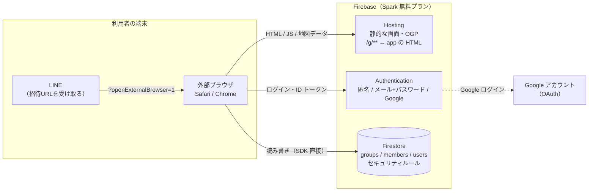

# システム構成

状態：レビュー待ち（技術選定は [ADR 0001](../adr/0001-backend-firebase.md)・[ADR 0002](../adr/0002-frontend-vanilla-vite.md) で確定させる。バックエンドを Firebase のままにするかは、費用の心配から基本設計で見直す：[Q-023](../open-questions.md)。この文書は Firebase を前提にしている）

## 構成図



- サーバーのプログラムは持たない。画面（ブラウザ）が Firebase の SDK で直接 Auth と Firestore を読み書きし、**アクセス制御はすべて Firestore のセキュリティルールで行う**
- 地図の形（47都道府県の SVG パス）は、ビルド時に画面へ埋め込む静的データ（`tools/paths.json`）。DB には入れない

## 使うサービス

| サービス | 役割 | 無料枠（Spark） |
|---|---|---|
| Hosting | 画面の配信。`/g/**` を画面の HTML に rewrite する | 保存 10GB、転送 10GB/月（料金ページの「360MB/日」との関係は要確認：Q-022）。超えると翌月まで止まる |
| Authentication | 匿名、メール＋パスワード、Google | 5万 MAU。新しいアカウント（匿名を含む）は IP ごとに1時間100件。確認メール 1,000通/日、パスワードの再設定 150通/日 |
| Firestore | データの保存 | 読み取り 5万/日（ルールの中の `get()` も数える）、書き込み 2万/日、削除 2万/日、保存 1GiB、送信 10GiB/月。1日の枠は太平洋時間の0時に戻る |

出典：[ADR 0003](../adr/0003-backend-selection.md) の「出典」（2026-10-03 調査）

### 認証の方針
- ログインなしの人も裏で**匿名認証**する。ルールで「認証済みでなければ書き込めない」にできる
- ログインしたときは匿名の状態を昇格する。詳しくは [auth-flow.md](auth-flow.md)
- 匿名の認証情報は自動削除しない（Identity Platform へのアップグレードが必要で、Spark では 3,000 DAU の上限が付くため。2026-10-03 に公式の auth/limits で確認：[ADR 0003](../adr/0003-backend-selection.md)）

### 招待URLのプレビュー（OGP）
- 全グループ共通の固定の OGP にする
- LINE のクローラーは JavaScript を実行しないので、固定の `og:title`・`og:description`・`og:image` を HTML に直接書く
- グループ名を出すにはサーバー側の処理（Cloud Functions）が要り、Blaze プランになるため MVP ではやらない

### Blaze（有料）プランが必要になる機能
MVP では使わない。
- Cloud Functions 全般（グループごとの OGP など）
- Cloud Storage（画像のアップロードなど）
- 電話番号での認証
- App Check（reCAPTCHA）で月1万回を超える場合

## 環境

| 環境 | 使うもの |
|---|---|
| ローカル開発 | Firebase Emulator Suite（Auth、Firestore、Hosting）。プロジェクトIDは `demo-` 始まりにし、本番に触れない |
| 本番 | Firebase プロジェクト1つ |

ステージング環境は MVP では作らない。

## 開発環境

- Node.js 20 以上
- **JDK 21 以上**（エミュレータに必要。公式の手順ページの「JDK 11 以上」は古い）
- `firebase-tools`（エミュレータ、デプロイ）
- `@firebase/rules-unit-testing`（ルールのテスト）
- Firebase JS SDK v12

## リポジトリの構成（予定）

```
docs/                設計書
tools/               地図データの生成（既存）
web/                 画面（Vite）            ← Phase 2 で追加
firestore.rules      セキュリティルール        ← Phase 1 で追加
tests/rules/         ルールのテスト            ← Phase 1 で追加
firebase.json        Hosting・エミュレータの設定
```
