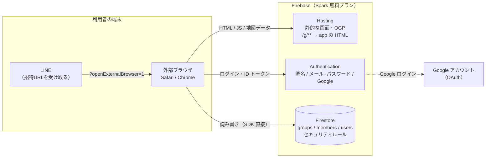

# システム構成

状態：レビュー待ち（技術選定は [ADR 0001](../adr/0001-backend-firebase.md)・[ADR 0004](../adr/0004-frontend-react-typescript.md)（ADR 0002 を置き換え） で確定させる。バックエンドを Firebase のままにするかは、費用の心配から基本設計で見直す：[Q-023](../open-questions.md)。この文書は Firebase を前提にしている。2026-10-10：ADR 0003 で案 C に決まり、ADR 0001 は置き換え）

> **注意（2026-10-04）**：この文書は Firebase 一式（[ADR 0003](../adr/0003-backend-selection.md) の案 A）を前提にした版。ADR 0003 では、Cloudflare Workers＋D1 に認証だけ Firebase Authentication を組み合わせる案 C を推奨にしていて、2026-10-10 に C に決まった。書き直しは [roadmap](../roadmap.md) の「次にやること」7.。画面は React＋TypeScript（[ADR 0004](../adr/0004-frontend-react-typescript.md)）

## 構成図



- サーバーのプログラムは持たない。画面（ブラウザ）が Firebase の SDK で直接 Auth と Firestore を読み書きし、**アクセス制御はすべて Firestore のセキュリティルールで行う**
- 地図の形（47都道府県の SVG パス）は、ビルド時に画面へ埋め込む静的データ（`tools/paths.json`）。DB には入れない

## 使うサービス

| サービス | 役割 | 無料枠（Spark） |
|---|---|---|
| Hosting | 画面の配信。`/g/**` を画面の HTML に rewrite する | 保存 10GB、転送 10GB/月（料金ページの「360MB/日」との関係は要確認：Q-022）。超えると翌月まで止まる |
| Authentication | 匿名、メール＋パスワード、Google | 5万 MAU。新しいアカウント（匿名を含む）は IP ごとに1時間100件。確認メール 1,000通/日、パスワードの再設定 150通/日 |
| Firestore | データの保存 | 読み取り 5万/日（ルールの中の `get()` も数える）、書き込み 2万/日、削除 2万/日、保存 1GiB、送信 10GiB/月。1日の枠は太平洋時間の0時に戻る |

出典：[ADR 0003](../adr/0003-backend-selection.md) の「出典」（2026-10-03 調査）

### 認証の方針
- ログインなしの人も裏で**匿名認証**する。ルールで「認証済みでなければ書き込めない」にできる
- ログインしたときは匿名の状態を昇格する。詳しくは [auth-flow.md](auth-flow.md)
- 匿名の認証情報は自動削除しない（Identity Platform へのアップグレードが必要で、Spark では 3,000 DAU の上限が付くため。2026-10-03 に公式の auth/limits で確認：[ADR 0003](../adr/0003-backend-selection.md)）

### 招待URLのプレビュー（OGP）
- 全グループ共通の固定の OGP にする
- LINE のクローラーは JavaScript を実行しないので、固定の `og:title`・`og:description`・`og:image` を HTML に直接書く
- グループ名を出すのは MVP ではやらない（requirements の「やらないこと」）

### 検索に出すページと出さないページ（NFR-019、NFR-005）

| | 検索に出すページ（トップ、使い方、プライバシーポリシー） | アプリの画面（`/g/**` など） |
|---|---|---|
| 作り方 | 中身を書いた素の HTML（[ADR 0004](../adr/0004-frontend-react-typescript.md)） | React の画面（1つの HTML から動く） |
| `noindex` | 付けない | **付ける**。JavaScript で後から足すのではなく、HTML の `<meta name="robots" content="noindex">` か、レスポンスのヘッダー（`X-Robots-Tag`）に最初から書く（検索エンジンが JavaScript を動かす前に読めるように） |
| `robots.txt` | 許可 | **禁止しない**。`robots.txt` で読むのを禁止すると、検索エンジンが `noindex` を読めず、URL だけが検索結果に載ることがある（要確認） |
| sitemap | 載せる | 載せない |
| OGP | ページごとの説明 | 全グループ共通の固定の OGP（上） |

招待URLが公開の場に貼られたとき、検索エンジンが `/g/<id>` を開いて API を呼ぶか（匿名ログインや読み取りが起きるか）は、Phase 2 で確かめる（要確認。ADR 0003 の「そのほか」に移した）。

### Blaze（有料）プランが必要になる機能
MVP では使わない。
- Cloud Functions 全般（グループごとの OGP など）
- Cloud Storage（画像のアップロードなど）
- 電話番号での認証
- App Check（reCAPTCHA）で月1万回を超える場合

## 環境

| 環境 | 使うもの |
|---|---|
| ローカル開発 | Firebase Emulator Suite（Auth、Firestore、Hosting）。プロジェクトIDは `demo-` 始まりにし、本番に触れない |
| 本番 | Firebase プロジェクト1つ |

ステージング環境は MVP では作らない。

## 開発環境

- Node.js 20 以上
- **JDK 21 以上**（エミュレータに必要。公式の手順ページの「JDK 11 以上」は古い）
- `firebase-tools`（エミュレータ、デプロイ）
- `@firebase/rules-unit-testing`（ルールのテスト）
- Firebase JS SDK v12

## リポジトリの構成（予定）

```
docs/                設計書
tools/               地図データの生成（既存）
web/                 画面（Vite＋React＋TypeScript）  ← Phase 2 で追加
  pages/             検索に出すページ（素の HTML：トップ、使い方、プライバシーポリシー）
  src/               アプリの画面（React）
```

バックエンドの分は、ADR 0003 の決定で変わる。

- 案 C（推奨）なら：`api/`（Hono の API、TypeScript）、`migrations/`（D1 のテーブル定義）、`wrangler.jsonc`（Cloudflare の設定）、`tests/api/`（API のテスト、Vitest）
- 案 A なら：`firestore.rules`（セキュリティルール）、`tests/rules/`（ルールのテスト）、`firebase.json`（Hosting・エミュレータの設定）
