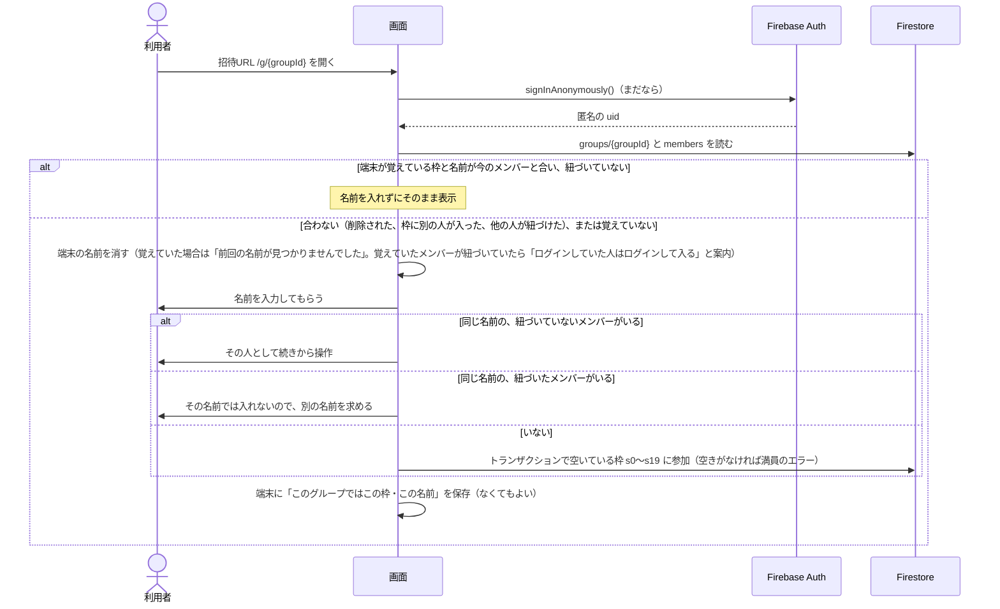
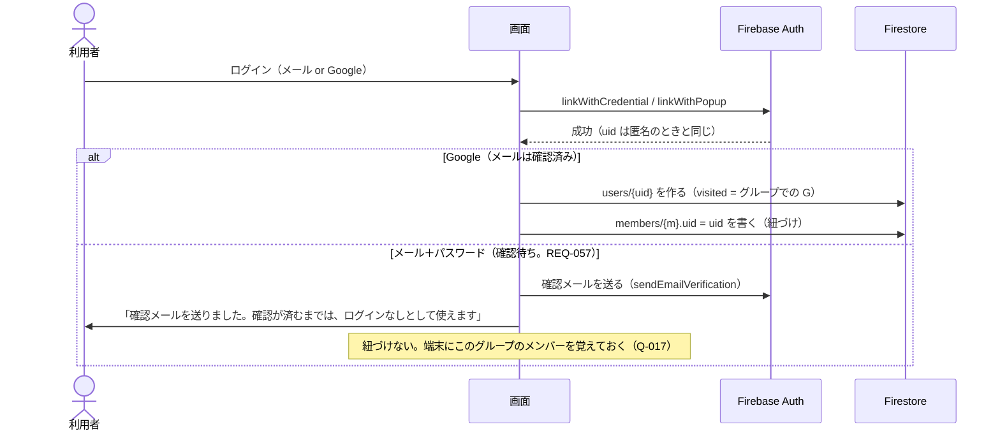
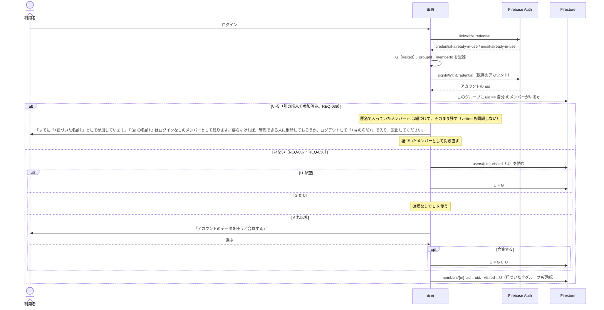
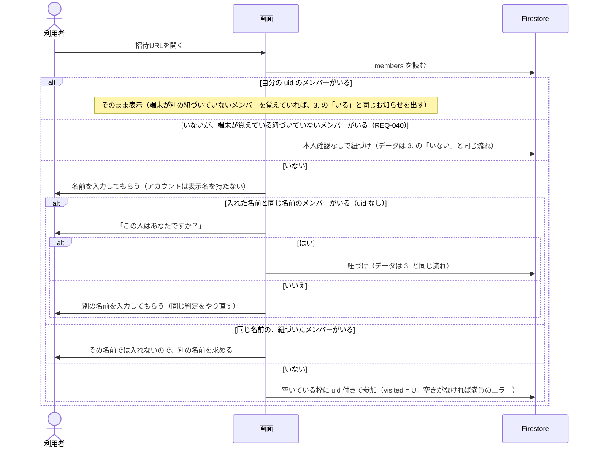
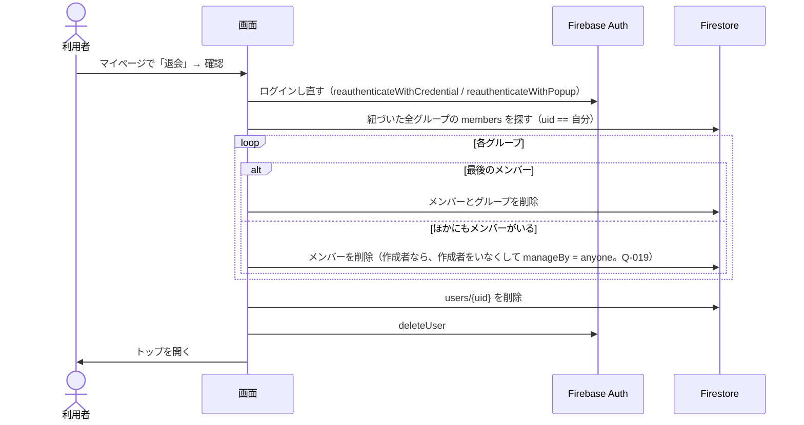

# 認証の流れ

状態：レビュー待ち（2026-10-02：名前の入力、作成者の引き継ぎ、ログアウト、退会を、要件定義の決定に合わせた。2026-10-03：同じアカウントのメンバーがすでにいるときは片方しか紐づけない（REQ-039）、他のグループは開いたときに端末の記憶で紐づける（REQ-040）に合わせた）

> **注意（2026-10-04）**：この文書は Firebase 一式（[ADR 0003](../adr/0003-backend-selection.md) の案 A）を前提にした版。ADR 0003 では、Cloudflare Workers＋D1 に認証だけ Firebase Authentication を組み合わせる案 C を推奨にしていて、小さく試して C に決まったら書き直す（[roadmap](../roadmap.md) の「次にやること」5.）。画面は React＋TypeScript（[ADR 0004](../adr/0004-frontend-react-typescript.md)）

関係する要件：[requirements.md](../requirements.md) の REQ-022〜REQ-043（ログインなしで使う、アカウントとログイン、ログインしたとき、グループに入るとき）、REQ-028（同じメールなら同じアカウント）、REQ-056（メンバーを変更する）、REQ-057〜REQ-059（確認メール、登録済みのとき、パスワード）、NFR-006 (9)(10)。各節と要件IDの細かい対応は基本設計で付ける。

## 1. ログインなしで参加する

- 端末に何をどこに覚えるかは要確認：Q-017

## 2. はじめてログインする（昇格）

メールやGoogleのアカウントがまだ使われていなければ、匿名のアカウントをそのまま昇格させる。**uid は変わらない**。

- 作成者は「作成者のメンバー」で決まる。作成者のメンバーを紐づけたら、そのアカウントが作成者になる。今の匿名の uid が、グループを作ったときの uid と同じとは限らない（作成者が別の端末から名前で入った、ログアウトして入り直した、など）ので、「uid が同じだから作成者のまま」とはしない。作成者をデータでどう持つか（`ownerUid` を更新するか、作成者のメンバーから引くか）は要確認：Q-019
- 3. の「すでに自分のアカウントのメンバーがいる」確認は、昇格では要らない（新しいアカウントなので、紐づいたメンバーはまだない）

### 確認メールが済んだ後（REQ-057・NFR-006 (10)）

- 確認のリンクは、メールのアプリから別のブラウザで開かれることが多い。そのブラウザでは「確認が済みました。元の画面に戻ってください」と出すだけにする
- 元の端末に戻ってグループを開いたら、ログインのトークン（証明書）を取り直す（`getIdToken(true)`）。取り直さないと、保存先は確認前の状態のまま判断する（ブログ。[ADR 0003](../adr/0003-backend-selection.md)）
- 確認済みになっていたら、端末が覚えているメンバーを紐づける（4. の「端末が覚えているメンバーがいる」と同じ。REQ-040）
- 保存先は、紐づけと作成者の設定変更を「確認済み（`email_verified == true`）、または Google」のときだけ許す。確認前のアカウントは「匿名ではない」が、ログインありとしては扱わない

## 3. 既存のアカウントにログインする（紐づけ）

メールやGoogleがすでに別のアカウントで使われていると、昇格は失敗する。このとき **uid が匿名のものからアカウントのものに変わる**ので、先にデータを退避しておく。

- 1つのグループで、1つのアカウントに紐づくメンバーは1人だけ。すでにいるときは、匿名で入っていたメンバーを紐づけず、ログインなしのメンバーとして残す。要らなければ、管理できる人が削除するか、本人がログアウトしてその名前で入り、退出する（REQ-039）。ルールでも「同じグループに同じ uid のメンバーが2つできない」ようにできるかは、Q-019 と一緒に確かめる
- 作成者は「作成者のメンバー」で決まる（[use-cases.md](../use-cases.md) の決定）。作成者のメンバーを紐づけたら、そのアカウントが作成者になる（持ち方は要確認：Q-019、ルールで書けるかは Q-012）。上の「いる」の場合、作成者のメンバー m はログインなしのまま残るので、作成者も m のまま（m が削除されたら、作成者はいなくなる：REQ-051）
- ログインしたときに紐づけるのは、開いていたグループだけ。同じ端末からログインなしで参加していた他のグループは、あとで開いたときに 4. の「端末が覚えているメンバーがいる」の流れで紐づける（REQ-040）。端末に何をどう覚えるかは要確認：Q-017
- 退避先はメモリか `sessionStorage`。Google ログインをリダイレクト方式にするとページが読み直されるので、ポップアップ方式を基本にする

## 4. ログインした状態でグループに入る

## 5. ログアウトする

- `signOut` してトップを開く。グループ一覧とマイページには入れなくなる
- 次にグループを開いたときは、1. と同じく匿名でサインインし、名前の入力から入る。紐づいたメンバーの名前ではログインなしで入れないので、参加の画面で「ログインしていた人はログインして入る」と案内する
- 端末に覚えた名前をログアウトのときに消すかは、端末に覚える内容と一緒に決める（要確認：Q-017）

## 6. 退会する

- アカウントの削除には、直前にログインしていることが必要（古いと `auth/requires-recent-login` で失敗する）。そのため先にログインし直してもらう（出典：https://firebase.google.com/docs/auth/web/manage-users#delete_a_user ）
- Firestore の削除はアカウントが残っているうちに行い、アカウントの削除は最後にする（先にアカウントを消すと、ルールで本人と確かめられなくなる）
- 途中で失敗したときにやり直せるようにするか、1つのバッチにまとめるかは、Q-010（グループ削除の後始末）と一緒に基本設計で決める

## LINE のアプリ内ブラウザ

- Google は WebView 内でのログインを禁止しているため、LINE のアプリ内ブラウザでは Google ログインができない（`disallowed_useragent`）
- 招待URLには `?openExternalBrowser=1` を付け、外部ブラウザで開かせる
- ログイン画面でも LINE のアプリ内ブラウザを検知したら、外部ブラウザで開くよう案内する

## 未確認のこと

- 匿名からメール＋パスワードへの昇格が SDK v12 で動くか。メール列挙保護が有効なプロジェクト（2023-09 以降に作ったものはデフォルトで有効）では、古い SDK で動かなかった記録がある。エミュレータと本番で確かめる
- メール列挙保護が有効だと、「このメールはもう登録済みか」を事前に調べられない。登録時のエラーで判断する前提にする
- 同じメールアドレスを、メール＋パスワードと Google の両方で使ったときの挙動（REQ-028。Google で入ったときにエラーになるか、確認前のパスワードが外れるか、など）。`researcher` で調べている（2026-10-04）。結果を見て「別の方法で登録済み」の分岐と案内の文面を足す
