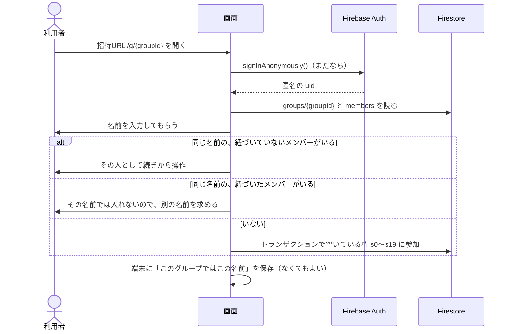
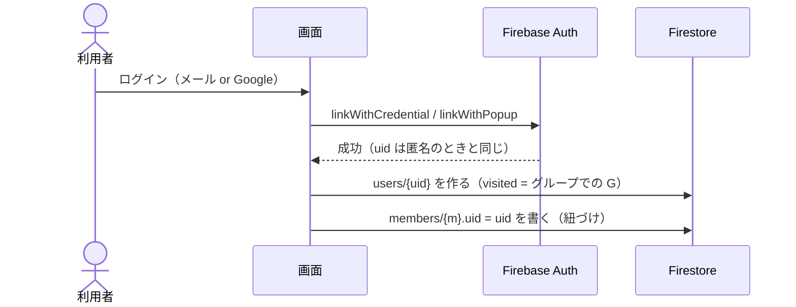
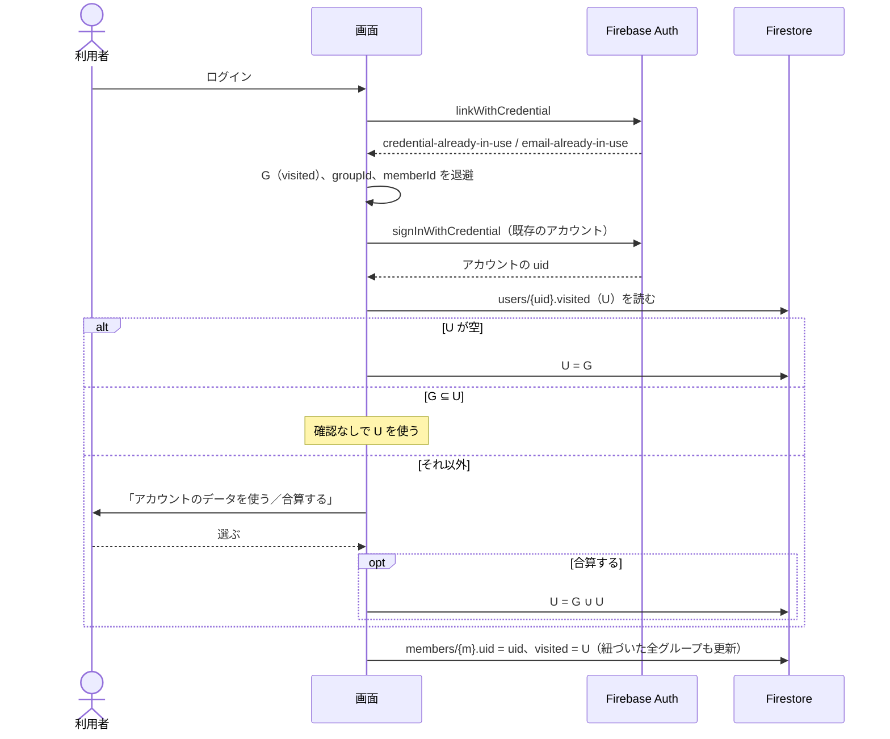
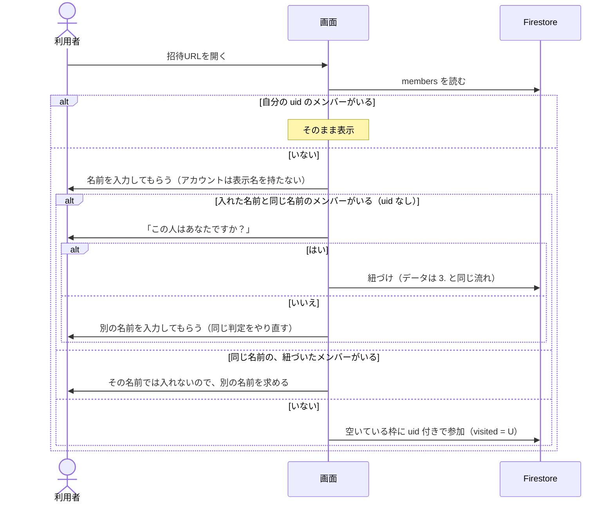
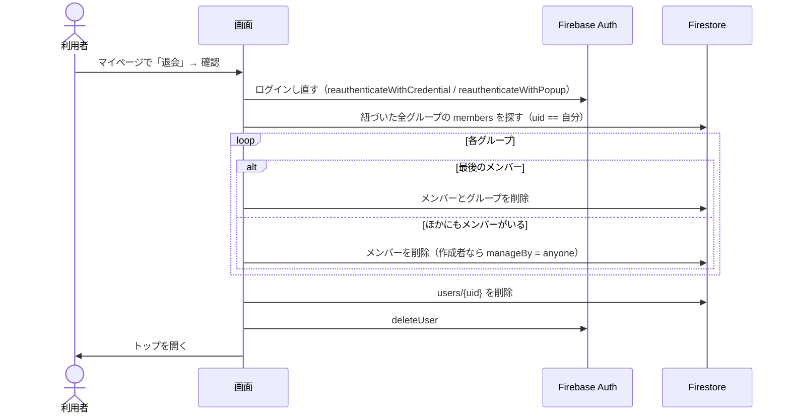

# 認証の流れ

状態：レビュー待ち（2026-10-02：名前の入力、作成者の引き継ぎ、ログアウト、退会を、要件定義の決定に合わせた）

関係する要件：[requirements.md](../requirements.md) の「ログインして使う」以降。

## 1. ログインなしで参加する

## 2. はじめてログインする（昇格）

メールやGoogleのアカウントがまだ使われていなければ、匿名のアカウントをそのまま昇格させる。**uid は変わらない**ので、`ownerUid` などはそのまま引き継がれる。

## 3. 既存のアカウントにログインする（合算）

メールやGoogleがすでに別のアカウントで使われていると、昇格は失敗する。このとき **uid が匿名のものからアカウントのものに変わる**ので、先にデータを退避しておく。

- 作成者は「作成者のメンバー」で決まる（[use-cases.md](../use-cases.md) の決定）。この場合も、作成者のメンバーを紐づけたら、`ownerUid` をアカウントの uid に更新する（ルールで書けるかは要確認：Q-012）
- 紐づけるのは、ログインしたときに開いていたグループだけ。同じ端末からログインなしで参加していた他のグループは、何もしない（暫定。端末に覚える内容（要確認：Q-017）を決めたら見直す）
- 退避先はメモリか `sessionStorage`。Google ログインをリダイレクト方式にするとページが読み直されるので、ポップアップ方式を基本にする

## 4. ログインした状態でグループに入る

## 5. ログアウトする

- `signOut` してトップを開く。グループ一覧とマイページには入れなくなる
- 次にグループを開いたときは、1. と同じく匿名でサインインし、名前の入力から入る。紐づいたメンバーの名前ではログインなしで入れないので、参加の画面で「ログインしていた人はログインして入る」と案内する
- 端末に覚えた名前をログアウトのときに消すかは、端末に覚える内容と一緒に決める（要確認：Q-017）

## 6. 退会する

- アカウントの削除には、直前にログインしていることが必要（古いと `auth/requires-recent-login` で失敗する）。そのため先にログインし直してもらう（出典：https://firebase.google.com/docs/auth/web/manage-users#delete_a_user ）
- Firestore の削除はアカウントが残っているうちに行い、アカウントの削除は最後にする（先にアカウントを消すと、ルールで本人と確かめられなくなる）
- 途中で失敗したときにやり直せるようにするか、1つのバッチにまとめるかは、Q-010（グループ削除の後始末）と一緒に基本設計で決める

## LINE のアプリ内ブラウザ

- Google は WebView 内でのログインを禁止しているため、LINE のアプリ内ブラウザでは Google ログインができない（`disallowed_useragent`）
- 招待URLには `?openExternalBrowser=1` を付け、外部ブラウザで開かせる
- ログイン画面でも LINE のアプリ内ブラウザを検知したら、外部ブラウザで開くよう案内する

## 未確認のこと

- 匿名からメール＋パスワードへの昇格が SDK v12 で動くか。メール列挙保護が有効なプロジェクト（2023-09 以降に作ったものはデフォルトで有効）では、古い SDK で動かなかった記録がある。エミュレータと本番で確かめる
- メール列挙保護が有効だと、「このメールはもう登録済みか」を事前に調べられない。登録時のエラーで判断する前提にする
