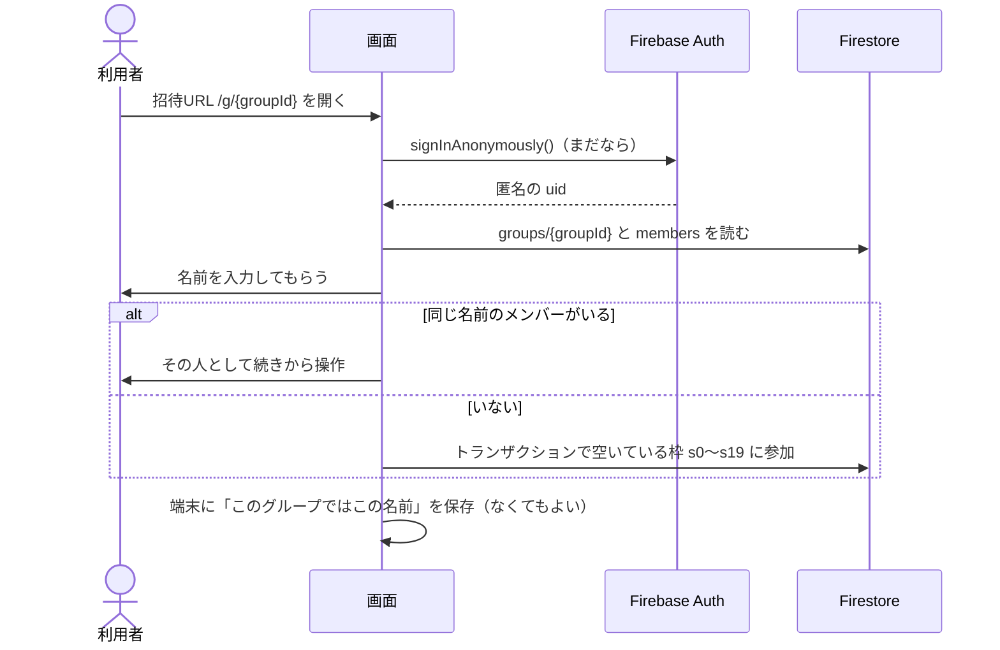
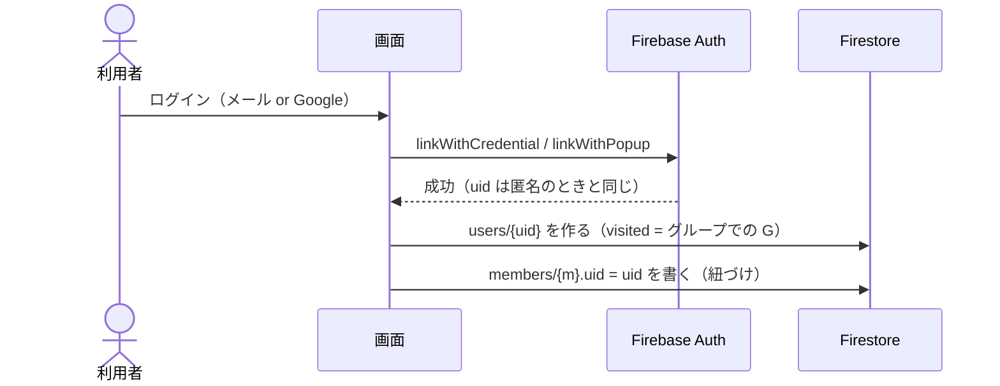
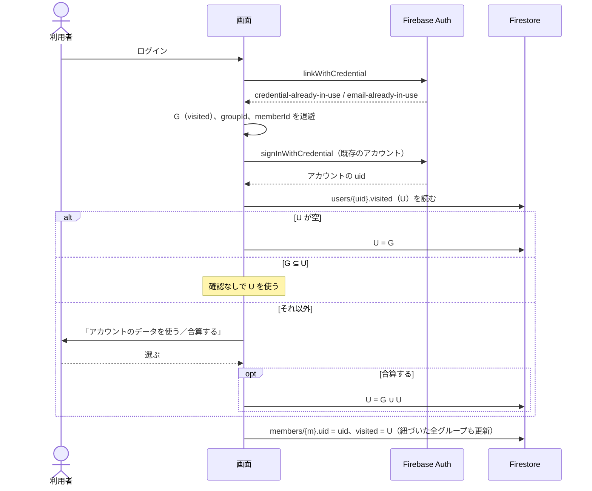
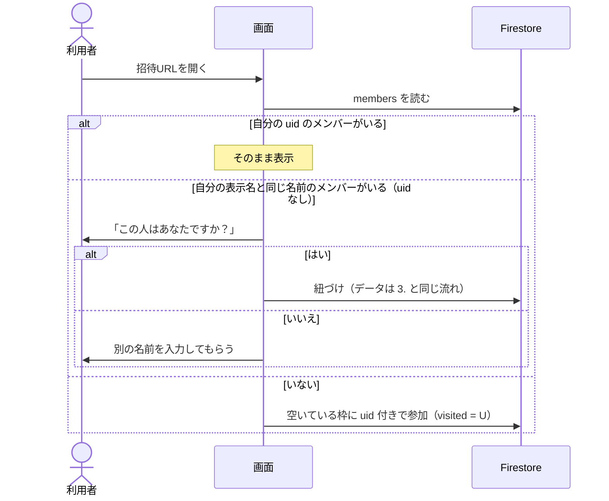

# 認証の流れ

状態：レビュー待ち

関係する要件：[requirements.md](../requirements.md) の「ログインして使う」以降。

## 1. ログインなしで参加する

## 2. はじめてログインする（昇格）

メールやGoogleのアカウントがまだ使われていなければ、匿名のアカウントをそのまま昇格させる。**uid は変わらない**ので、`ownerUid` などはそのまま引き継がれる。

## 3. 既存のアカウントにログインする（合算）

メールやGoogleがすでに別のアカウントで使われていると、昇格は失敗する。このとき **uid が匿名のものからアカウントのものに変わる**ので、先にデータを退避しておく。

- 匿名のときに作ったグループの `ownerUid` は、この場合は引き継がない（MVP での割り切り）
- 退避先はメモリか `sessionStorage`。Google ログインをリダイレクト方式にするとページが読み直されるので、ポップアップ方式を基本にする

## 4. ログインした状態でグループに入る

## LINE のアプリ内ブラウザ

- Google は WebView 内でのログインを禁止しているため、LINE のアプリ内ブラウザでは Google ログインができない（`disallowed_useragent`）
- 招待URLには `?openExternalBrowser=1` を付け、外部ブラウザで開かせる
- ログイン画面でも LINE のアプリ内ブラウザを検知したら、外部ブラウザで開くよう案内する

## 未確認のこと

- 匿名からメール＋パスワードへの昇格が SDK v12 で動くか。メール列挙保護が有効なプロジェクト（2023-09 以降に作ったものはデフォルトで有効）では、古い SDK で動かなかった記録がある。エミュレータと本番で確かめる
- メール列挙保護が有効だと、「このメールはもう登録済みか」を事前に調べられない。登録時のエラーで判断する前提にする
