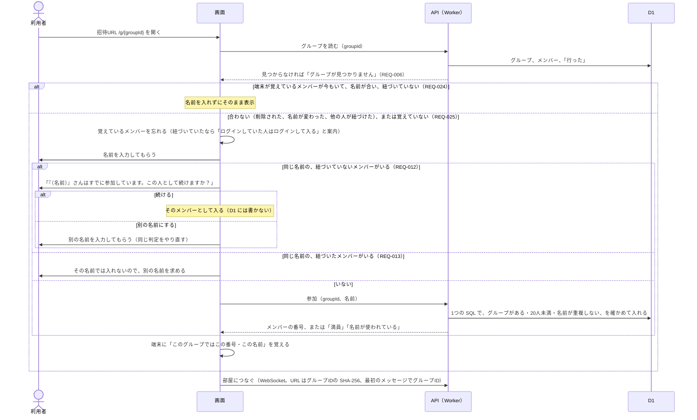
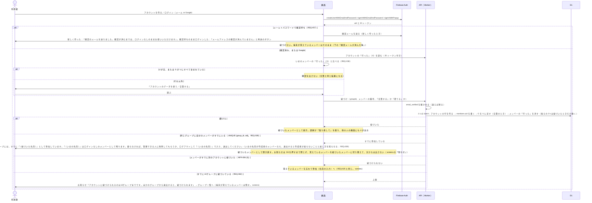
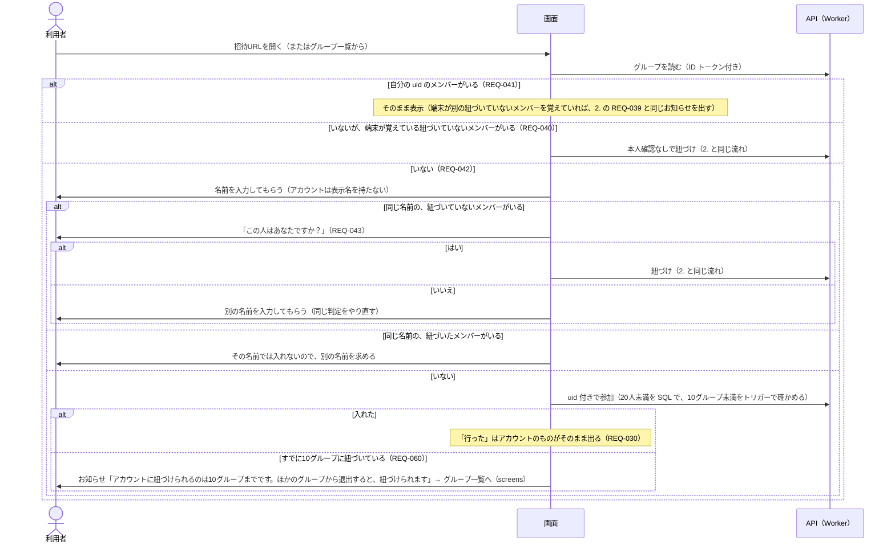
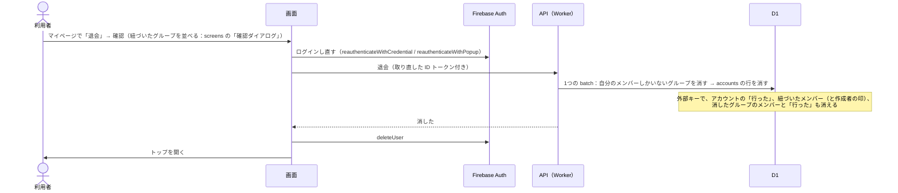

# 認証の流れ

状態：下書き（2026-10-11：Q-020 の `/review-docs`（21件）を受けて、確認待ちのままログインしたときの知らせと、紐づけ・参加が断られたときの行き先を足した。2026-10-11：Q-020 を決めて、確認待ちの間の画面、REQ-039 のお知らせを1度だけ出すこと、退会の確認の参照先を足した。2026-10-11：権限マトリクスの `/review-docs`（14件）を受けて、REQ-039 の知らせに、作成者のメンバーのときの注意を足した。2026-10-10：`/review-docs` を反映（ログインなしでも同じ名前の確認を出す、退会の `auth_time`、10グループの上限）。[ADR 0003](../adr/0003-backend-selection.md) が案 C に決まったので、Firebase 一式（匿名ログインと昇格）の版から書き直した。元の版は git の履歴にある。ログインなしの人は匿名ログインをせず、ログインする人だけが Firebase Authentication を使う。データの形は [data-model.md](data-model.md)）

関係する要件：[requirements.md](../requirements.md) の REQ-022〜REQ-043（ログインなしで使う、アカウントとログイン、ログインしたとき、グループに入るとき）、REQ-028（同じメールなら同じアカウント）、REQ-056（メンバーを変更する）、REQ-057〜REQ-059（確認メール、登録済みのとき、パスワード）、NFR-006 (1)(3)(6)(9)(10)、Q-018（紐づいたメンバーは本人だけが操作できる）、Q-032・REQ-060（紐づけは10グループまで）。

## 前提

- **ログインなしの人**は Firebase を使わない。API には証明書なしで、グループIDとメンバーの番号を送る（信頼ベース：REQ-022）
- **ログインしている人**は、API を呼ぶたびに ID トークンを `Authorization` ヘッダーで送る。API は署名と `aud`・`iss` を確かめ、`uid` と `email_verified` を取り出す（[architecture.md](architecture.md) の「認証の方針」）
- **確認待ち**（`email_verified` が false）の人は、API はログインなしとして扱う。紐づけと作成者の設定変更は断る（REQ-057、NFR-006 (10)）
- 端末には、グループごとに「覚えているメンバーの番号と名前」を持つ（何をどこに覚えるかの細部は要確認：Q-017）
- 匿名ログインがないので、案 A にあった「昇格」（匿名の `uid` のままアカウントになる）と、「既存のアカウントにログインすると `uid` が変わる」場面はない。新しくアカウントを作るときも、作ってあるアカウントにログインするときも、紐づけは同じ流れ（2.）になる

## 1. ログインなしで参加する

- 画面が「同じ名前のメンバーがいるか」を見て分けるのは案内のため。実際の重複は D1 の `UNIQUE (group_id, name_key)` が守る（NFR-006 (11)）。2人がほぼ同時に同じ名前で入ったら、後の方は「名前が使われている」になるので、画面はグループを読み直して、上の判定（REQ-012・REQ-013）をやり直す
- 同じ名前で入るときの確認（「この人として続けますか？」）は、ログインなしでも出す（2026-10-10 にユーザーと決めた。たまたま同じ名前の別人が入ってしまうのを防ぐ。REQ-012）
- 「行った」の付け外しと退出は、API にグループIDとメンバーの番号を送る。API は、そのメンバーがそのグループにいて、紐づいていないこと（紐づいていれば、ログイン済みの本人であること）を、書き込む SQL の `WHERE` で確かめる（NFR-006 (1)、Q-018。[data-model.md](data-model.md) の「ログインしている人の扱い」）

## 2. ログインして、いまのグループのメンバーを紐づける

新しくアカウントを作るとき（REQ-027）も、作ってあるアカウントにログインするとき（REQ-028）も同じ。

- 紐づけの `UPDATE` は「`uid` が `NULL` のメンバーだけ」を条件にし、10グループの上限はトリガーでエラーにする（エラーなら batch ごと取り消される）。G を U に足す文とメンバーの「行った」を消す文は、紐づけが成功したときだけ動く条件を付ける（[data-model.md](data-model.md) の「紐づけ」）
- 作成者のメンバー（`is_owner = 1`）を紐づけたら、ログインした本人が作成者として設定を変えられるようになる（REQ-037）。印は動かない。REQ-039 の場合、いま入っていたメンバーはログインなしのまま残るので、作成者の印もそのメンバーに残る
- ログインしたときに紐づけるのは、開いていたグループだけ。同じ端末からログインなしで参加していた他のグループは、あとで開いたときに 3. の「端末が覚えている紐づいていないメンバーがいる」の流れで紐づける（REQ-040）
- Google ログインはポップアップ方式にする（画面のドメインと Firebase の認証のドメインが違っても動くため。ページも読み直されないので、いまのグループとメンバーを覚え直す必要がない）

### 確認メールが済んだ後（REQ-057・NFR-006 (10)）

2026-10-10 に決めた（[ADR 0003](../adr/0003-backend-selection.md) の決定の基準4）。

- 確認のリンクは、メールのアプリから別のブラウザで開かれることが多い。そのブラウザでは「確認が済みました。元の画面に戻ってください」と出すだけにする
- 元の端末に戻ってグループを開いたとき、画面に戻ってきたとき、メニューの「確認した」を押したときに、ID トークンを取り直す（`getIdToken(true)`）。確認待ちの間、メニューには確認待ちの表示（再送、確認した、ログアウト）を出し、マイページとグループ一覧は開けない（[screens.md](screens.md) の「メニューの中身」。2026-10-11：Q-020）。取り直さないと、トークンの中の `email_verified` は確認前のままで、API は紐づけを断る
- 確認済みになっていたら、端末が覚えているメンバーを紐づける（3. の「端末が覚えている紐づいていないメンバーがいる」と同じ。REQ-040）
- 断る処理とトークンの取り直しは、紐づけの API を作る Phase 3 にローカルのテストで確かめる

## 3. ログインした状態でグループに入る

- 確認待ちの人は、API がログインなしとして扱うので、1. の流れになる
- ログインしたままグループを作るときも、10グループに達していれば断る（REQ-060）。作成者のメンバーは最初から自分のアカウントに紐づく（REQ-001）

## 4. ログアウトする

- `signOut` してトップを開く。グループ一覧とマイページには入れなくなる（REQ-034）
- 次にグループを開いたときは、1. と同じくログインなしとして、名前の入力から入る。紐づいたメンバーの名前ではログインなしで入れないので、参加の画面で「ログインしていた人はログインして入る」と案内する（REQ-035）
- 端末に覚えたメンバーをログアウトのときに消すかは、端末に覚える内容と一緒に決める（要確認：Q-017）

## 5. 退会する

- 消せるのは、ID トークンの `uid` のアカウントだけ（NFR-006 (6)）
- API は、ID トークンの `auth_time`（最後にログインした時刻）が数分以内でなければ断る（2026-10-10 にユーザーと決めた）。画面の「ログインし直す」だけでは、改造した画面から、ログインし直さずに退会させられるため。何分にするかと作る時期は、ADR 0003 の「そのほか」に合わせて Phase 2 で決める
- Firebase のアカウントの削除にも、直前にログインしていることが必要（古いと `auth/requires-recent-login` で失敗する。出典：https://firebase.google.com/docs/auth/web/manage-users#delete_a_user ）
- D1 を先に消し、Firebase のアカウントは最後に消す（先に消すと、API で本人と確かめられなくなる）。D1 を消した後に `deleteUser` が失敗しても、マイページの「退会」をもう一度押せばやり直せる（D1 の側は消すものがなくても成功する）
- `deleteUser` が失敗したまま画面を使い続けると、手元の ID トークン（最大1時間有効）で「行った」を保存したときに `accounts` の行が作り直される。害は小さい（メンバーは消えている）ので受け入れ、退会に失敗したら画面はログアウトして、やり直しを案内する
- 作成者のメンバーが消えると、そのグループの作成者はいなくなり、管理できる人は「誰でも」として扱われる（REQ-051。[data-model.md](data-model.md) の「作成者」）

## LINE のアプリ内ブラウザ

- Google は WebView 内でのログインを禁止しているため、LINE のアプリ内ブラウザでは Google ログインができない（`disallowed_useragent`）
- 招待URLには `?openExternalBrowser=1` を付け、外部ブラウザで開かせる
- ログイン画面でも LINE のアプリ内ブラウザを検知したら、外部ブラウザで開くよう案内する

## 未確認のこと

- メール列挙保護が有効だと、「このメールはもう登録済みか」を事前に調べられない。登録時のエラーで判断する前提にする
- 下の「同じメールアドレスを別のログイン方法で使ったとき」の (a)(b)。実機で試す

## 同じメールアドレスを別のログイン方法で使ったとき（REQ-028）

2026-10-04 に `researcher` で調べた。Firebase の設定は既定のまま（「1つのメールアドレスに1つのアカウント」、メールの列挙保護はオン）。Google は gmail のアドレスでは「信頼できる」ログイン元で、確認済みとみなされる（公式）。メール＋パスワードの組み合わせは公式の表になく、(a)(b) は推論（要確認：実機で試す）。

| 場面 | 挙動 |
|---|---|
| (a) 確認済みのパスワードのアカウントの人が、同じ gmail で Google ログイン | エラーなしで同じアカウントになる見込み（推論） |
| (b) Google で作った人が、同じメールでパスワードの新規登録 | `auth/email-already-in-use` で失敗する見込み（ブログ）。「登録できませんでした。すでにアカウントをお持ちならログインしてください」（REQ-058） |
| (c) **確認前のパスワードのアカウントに、同じメールで Google ログイン** | Google が上書きし、**パスワードは外れる**（なりすまし対策：公式）。パスワードで入りたければ再設定で付け直す |
| gmail 以外のメールで Google ログインし、別の方法で登録済み | `auth/account-exists-with-different-credential`。そのログイン方法で入ってもらい、`error.credential` で後から結ぶ（公式） |

(c) では `uid` は変わらない見込みなので、紐づいたメンバーはそのまま（要確認）。

メールの列挙保護がオンだと、「このメールはどの方法で登録されているか」を画面から調べられない（公式）。そのため案内の文は、メールによって出し分けず、すべて同じにする。

| 場面 | 案内の文（案） |
|---|---|
| 登録した | 「確認のメールを送りました。確認が済むまでは、ログインなしのままお使いいただけます」 |
| 登録に失敗 | 「登録できませんでした。すでにアカウントをお持ちなら、ログインしてください」 |
| ログインに失敗 | 「メールアドレスまたはパスワードが違います。Google で登録した方は『Google でログイン』を押してください。パスワードを忘れたときは、再設定できます」 |
| 別のログイン方法で登録済み | 「このメールアドレスは、別のログイン方法で登録されています。そのログイン方法でログインしてください」 |

出典：https://docs.cloud.google.com/identity-platform/docs/concepts-manage-users 、https://docs.cloud.google.com/identity-platform/docs/admin/email-enumeration-protection 、https://firebase.google.com/docs/auth/web/google-signin 、https://firebase.google.com/docs/auth/web/email-link-auth 、https://firebase.google.com/docs/auth/web/account-linking
