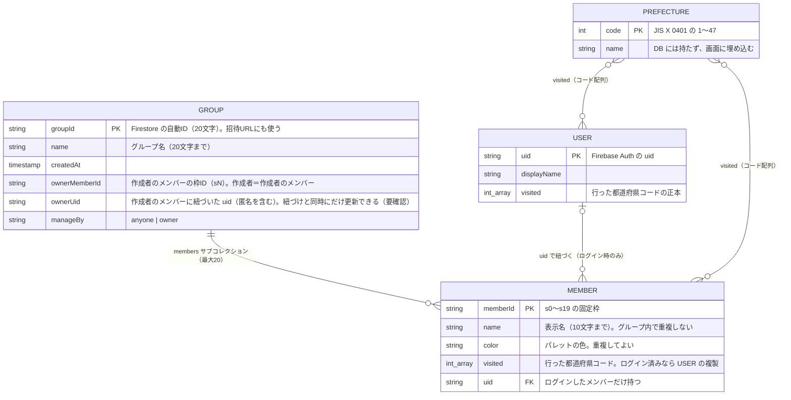

# データモデル

状態：レビュー待ち

## ER図

Firestore はリレーショナルDBではないが、関係を把握するために ER 図で表す。



## Firestore の構造

```
groups/{groupId}                 name, createdAt, ownerUid, manageBy
  └ members/{s0〜s19}            name, color, visited: number[], uid?
users/{uid}                      displayName, visited: number[]
```

## 設計上のポイント

### メンバーのIDは20枠に固定する
- ルールではサブコレクションの件数を数えられないため、メンバーのIDを `s0`〜`s19` に限定して20人の上限を守る
- 参加するときは、トランザクションで空いている枠を選んで作る（同じIDがすでにあれば作成は失敗する）

### 「行った」の付け外し
- `arrayUnion` / `arrayRemove` を使う。サーバー側でアトミックに適用されるので、別の県を同時に塗っても消し合わない
- 同じ県を付ける操作と外す操作がぶつかったら、後に届いた方が勝つ

### ログイン済みのメンバーの「行った」は複製する
- 正本は `users/{uid}.visited`。本人しか読めない
- 他の人に見せるため、`members/{m}.visited` にも同じ内容を持つ
- 本人が塗ったら、1回のバッチで `users/{uid}` と、紐づいている全グループのメンバーを同時に更新する（バッチは最大500件でアトミック）

### 参加中のグループの一覧
- コレクショングループクエリ（全グループの `members` から `uid == 自分` を検索）で取る
- `users` にグループIDの一覧は持たない（二重管理でずれるのを防ぐ）
- このクエリ用の複合インデックスは不要（単一フィールドの等価条件のため）

### 名前の重複
- ルールでは防げない。参加するときにトランザクションで同じグループのメンバーを確認する
- ほぼ同時に同じ名前で参加する競合は許容する

### グループの削除
- 親のドキュメントを消してもサブコレクションは残る。先に `members`（最大20件）をバッチで消してからグループを消す

## セキュリティルールの方針

| 対象 | 操作 | 許可する条件 |
|---|---|---|
| `groups/{g}` | get | 認証済み（匿名を含む） |
| | list | 禁止（グループIDを知らないと読めない） |
| | create | 認証済みで、`ownerUid` が自分、`manageBy` が `anyone` |
| | update（名前） | `manageBy` が `anyone`、または自分が `ownerUid` |
| | update（`manageBy`） | 自分が `ownerUid` で、ログイン済み（匿名ではない） |
| | delete | 名前の変更と同じ |
| `members/{m}` | get / list | 認証済み |
| | create | IDが `s0`〜`s19`。`uid` を付けるなら自分の uid でログイン済み |
| | update（`visited`） | `uid` がなければ認証済みなら誰でも。あれば本人だけ |
| | update（名前・色） | `uid` があれば本人だけ。なければ `manageBy` に従う |
| | update（紐づけ） | `uid` がないメンバーに、ログイン済みの本人が自分の `uid` を書く |
| | delete | `manageBy` に従う |
| 全グループの `members` | list（横断検索） | 検索結果が `uid == 自分` のものだけ |
| `users/{uid}` | すべて | 本人だけ |

ほかに入れる検証：
- フィールド名のホワイトリスト（決まったフィールド以外は書けない）
- `visited` の要素が 1〜47 の整数であること
- 名前の長さ（グループ名20文字、表示名10文字）

ルールの叩き台は Firebase 調査のときに作ったものがあり、`firestore.rules` を書くときの出発点にする。

## 読み書きの回数の見積もり

グループの画面を開くたびに、グループ1件と members 最大20件の読み取り（約21回）。無料枠の5万回/日なら、1日に約2,000回開ける。友達グループの規模なら十分に収まる。
