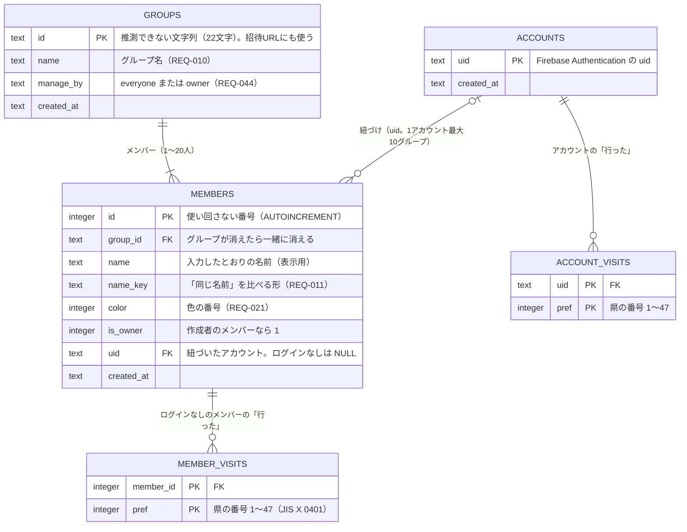

# データモデル

状態：下書き（2026-10-10：[ADR 0003](../adr/0003-backend-selection.md) が案 C（Cloudflare Workers＋Hono＋D1、認証だけ Firebase Authentication）に決まったので、Firestore の版から D1 の版に書き直した。元の版は git の履歴にある。形は [spike/migrations/0001_init.sql](../../spike/migrations/0001_init.sql) の試作をもとにし、試作から変えたところは「試作からの変更」に書いた。2026-10-10 にユーザーと決めた：作成者はメンバーの印 `is_owner` で持つ、メールアドレスは D1 に持たない）

## 考え方

- データの正本は D1（SQLite）の1か所。リアルタイムの部屋（Durable Objects）は「変わったこと」を配るだけで、データを持たない（[ADR 0003](../adr/0003-backend-selection.md) の「リアルタイムの共有」）
- 画面を改造されても破られたくない決まり（NFR-006）は、できるだけデータベースの制約（`CHECK`・`UNIQUE`・外部キー）に持たせる。制約で書けないものは API の1つの SQL か batch の中で判断する（D1 には途中で他の人を待たせるトランザクションがないため）
- 同じ事実を2か所に持たない（片方だけ古くなると抜け道になる：[learnings](../learnings/2026-10-02-owner-and-slot-lifecycle.md)）
- 個人情報は要るものだけ持つ（NFR-007）

## ER図

県の名前と地図の形は、データベースに持たず画面に埋め込む。

## テーブル

### groups（グループ）

| 列 | 型 | 決まり | 要件 |
|---|---|---|---|
| `id` | TEXT | 主キー。`crypto.getRandomValues` で作る英数字22文字（約128ビット）。`CHECK (length(id) >= 20)` | NFR-005 |
| `name` | TEXT | `NOT NULL`。`CHECK (length(name) BETWEEN 1 AND 40)`。見た目の1〜20文字は API で数える。ここは大量のデータを書かれないための、余裕のある上限 | REQ-010、NFR-006 (8) |
| `manage_by` | TEXT | `'everyone'`（初期値）か `'owner'` | REQ-044 |
| `created_at` | TEXT | 作った日時（UTC の ISO 8601） | NFR-010 |

作成者はこの表に持たない（下の「作成者」）。

### members（メンバー）

| 列 | 型 | 決まり | 要件 |
|---|---|---|---|
| `id` | INTEGER | 主キー。`AUTOINCREMENT` で、消したメンバーの番号を使い回さない | REQ-025、REQ-052 |
| `group_id` | TEXT | `NOT NULL REFERENCES groups (id) ON DELETE CASCADE` | REQ-047 |
| `name` | TEXT | 入力したとおり（前後の空白は API で取る）。`CHECK (length(name) BETWEEN 1 AND 40)`。見た目の1〜10文字は API で数える | REQ-009、NFR-006 (8) |
| `name_key` | TEXT | 比べる形。API で NFKC にそろえてから小文字にする。`CHECK (length(name_key) BETWEEN 1 AND 40)` | REQ-011 |
| `color` | INTEGER | パレットの番号。`CHECK (color BETWEEN 0 AND 19)`。参加したときに API が「使われていない番号の小さい順」で決める。変える API は作らない | REQ-021 |
| `is_owner` | INTEGER | 0 か 1。`CHECK (is_owner IN (0, 1))` | REQ-052 |
| `uid` | TEXT | `REFERENCES accounts (uid) ON DELETE CASCADE`。ログインなしは `NULL`（空の文字にしない） | REQ-037、REQ-036 |
| `created_at` | TEXT | 参加した日時 | — |

制約：
- `UNIQUE (group_id, name_key)`：1つのグループで同じ名前は1人だけ（NFR-006 (11)）
- `UNIQUE (group_id, uid)`：1つのグループで、1つのアカウントに紐づくメンバーは1人だけ（NFR-006 (9)）。`NULL` どうしは重複とみなされないので、ログインなしのメンバーは何人でもよい
- `CREATE UNIQUE INDEX … ON members (group_id) WHERE is_owner = 1`：作成者のメンバーは1グループに1人まで（NFR-006 (4)）

### member_visits（ログインなしのメンバーの「行った」）

| 列 | 型 | 決まり |
|---|---|---|
| `member_id` | INTEGER | `REFERENCES members (id) ON DELETE CASCADE` |
| `pref` | INTEGER | `CHECK (pref BETWEEN 1 AND 47)` |

主キーは `(member_id, pref)`。1県1行。付けるのは `INSERT … ON CONFLICT DO NOTHING`、外すのは `DELETE`（[rules/sql.md](../../.claude/rules/sql.md)）。押し直しても結果が変わらず、別の県を同時に塗っても消し合わない（NFR-009）。

紐づいたメンバーは、この表に行を持たない（紐づけるときに消す：下の「紐づけ」）。

### accounts（アカウント）

| 列 | 型 | 決まり |
|---|---|---|
| `uid` | TEXT | 主キー。Firebase Authentication の `uid`。`CHECK (length(uid) BETWEEN 1 AND 128)` |
| `created_at` | TEXT | 最初に紐づけたか「行った」を保存した日時 |

行は、ログインした人が初めて「行った」を保存するか、メンバーに紐づけるときに API が作る。**メールアドレスは持たない**（下の「メールアドレス」）。

### account_visits（アカウントの「行った」）

| 列 | 型 | 決まり |
|---|---|---|
| `uid` | TEXT | `REFERENCES accounts (uid) ON DELETE CASCADE` |
| `pref` | INTEGER | `CHECK (pref BETWEEN 1 AND 47)` |

主キーは `(uid, pref)`。ログインしている人の「行った」の正本で、全グループで共有する（REQ-030）。メンバーには写さない。グループの地図を出すときは、紐づいたメンバーなら `account_visits` を、そうでなければ `member_visits` を読んで合わせる（下の「グループを開く」）。

## 設計のポイント

### 作成者

**作成者のメンバーに `is_owner = 1` を付ける**（2026-10-10 にユーザーと決めた。試作と [ADR 0003](../adr/0003-backend-selection.md) の「C で書き直すときの方針」は `groups.owner_member_id` だった）。どちらの形でも作成者は1グループに1人までで、1つのアカウントが作成者になれるのは自分で作ったグループの数だけ（紐づけは最大10グループ：Q-032）。

- 作成者のメンバーが消えれば（退出、削除、退会、グループの削除）、印も一緒に消える。「作成者がいなくなる」（REQ-051）を、消すときに何もしなくても守れる
- 印はメンバーの行にあるので、**別のグループのメンバーが作成者になることが、形の上で起きない**。試作の `owner_member_id` だと、別のグループのメンバーの番号も入れられてしまい、API のテストで守る必要があった（[ADR 0003](../adr/0003-backend-selection.md) の「C で書き直すときの方針」）
- `groups` と `members` がお互いを指す（循環する外部キー）こともなくなり、グループを作る batch が1文減る
- `is_owner` を 1 にするのはグループを作るときだけ。後から付ける API は作らない（「作成者を勝手に変えられない」：NFR-006 (4)）
- 「作成者のみ」が効くかは `manage_by = 'owner'` かつ「`is_owner = 1` のメンバーがいる」で計算する。作成者がいなくなったら、`manage_by` を書き換えなくても「誰でも」として扱う（REQ-051）

場面ごとの確かめ（[learnings](../learnings/2026-10-02-owner-and-slot-lifecycle.md) の表）：

| 場面 | どうなるか |
|---|---|
| 生まれる | グループを作るときに、最初のメンバーに付く（REQ-001） |
| 紐づける | 作成者のメンバーに紐づけると、ログインした本人が作成者として設定を変えられる（REQ-037）。印は動かない |
| 消える | 本人の退出・他の人による削除・退会・グループの削除のどれでも、メンバーの行と一緒に消える |
| 使い回される | 番号を使い回さないので、後から入った人が作成者になることはない。同じ名前で入り直しても新しいメンバーで、印は付かない（2026-10-05 の試作で確認） |
| 別の入口から来る | ログインなしなら、作成者の名前で入れば作成者のメンバーとして操作できる（信頼ベース：REQ-052）。ただし管理できる人を変えるのはログインしている作成者だけ（REQ-045） |

### メールアドレス

**D1 にはメールアドレスを持たない**（2026-10-10 にユーザーと決めた）。 Firebase Authentication がすでに持っていて、マイページ（REQ-033）は画面が Firebase の SDK から読める。API が要るときは ID トークンの `email` と `email_verified` を見る。D1 に写すと、変えたときや退会のときに2か所を直す必要が出て、漏れたときの影響も広がる。

問い合わせのフォーム（NFR-018）の返信先は、フォームに入れてもらう（ログインしていない人も使うため。表の形は Phase 2 で決める）。

### 「行った」と紐づけ

- ログインなしのメンバーの「行った」は `member_visits`、ログインしている人の分は `account_visits` の1か所（REQ-023・REQ-030）
- **紐づけ**（REQ-037〜REQ-040）は1つの batch で行う：(1) `accounts` に行がなければ作る、(2) REQ-038 の選び方に従って、G（`member_visits`）を U（`account_visits`）に足すか、捨てる、(3) そのメンバーの `member_visits` を消す、(4) `members.uid` を書く。(4) は `uid IS NULL` の行だけを書き換える条件付きの `UPDATE` にする（紐づいたメンバーを付け替えられない：NFR-006 (3)）
- 紐づける前に、API が ID トークンの `email_verified` を見る（確認待ちなら断る：NFR-006 (10)、[ADR 0003](../adr/0003-backend-selection.md) の基準の4）
- 1つのアカウントが紐づけられるのは10グループまで（Q-032）。(4) の `UPDATE` に「`uid` が同じメンバーが10未満」の条件を入れる
- 同じグループにすでに自分のメンバーがいれば、`UNIQUE (group_id, uid)` で失敗するので、API はそれを REQ-039 の案内に変える
- 紐づいたメンバーの「行った」と名前を変える API は、ID トークンの `uid` がそのメンバーの `uid` と同じときだけ通す（NFR-006 (1)）

### グループを開く

1回の batch で、グループ、メンバー、ログインなしのメンバーの「行った」、紐づいたメンバーのアカウントの「行った」を読む。最後の2つは、`members` と結合してそのグループの分だけを読む（NFR-006 (2)：アカウントの「行った」は同じグループのメンバーだけが読める）。

### 参加する

1つの SQL で、グループがあること・20人未満であることを確かめて入れる（`INSERT … SELECT … WHERE EXISTS (…) AND (SELECT count(*) …) < 20`。REQ-005、NFR-006 (8)）。名前の重複と1アカウント1メンバーは `UNIQUE` で失敗させ、API が理由を読み分ける。色の番号もこの SQL の中で決める。

### 退出・削除・退会

- **退出・メンバーの削除**（REQ-048・REQ-049）：メンバーを消すのと、「0人ならグループを消す」を同じ batch にする（REQ-050。Q-010）。「行った」は外部キーで一緒に消える
- **グループの削除**（REQ-047）：`groups` の行を消せば、メンバーと `member_visits` が外部キーで消える。`account_visits` は残る
- **退会**（REQ-036）：`accounts` の行を消すと、`account_visits` と、紐づいたメンバー（とその作成者の印）が外部キーで消える。同じ batch で、そのせいで0人になったグループも消す。Firebase のアカウントの削除は、D1 を消した後に画面から行う（流れは [auth-flow.md](auth-flow.md)）

### 管理できる人の操作

グループ名の変更、グループの削除、メンバーの削除は、`manage_by` と作成者を同じ SQL の `WHERE` で確かめる（NFR-006 (5)）。`manage_by` を変える API は、ID トークンが確認済みで、その `uid` が `is_owner = 1` のメンバーの `uid` と同じときだけ通す（NFR-006 (4)(10)、REQ-045）。

## 保存先で守るもの（NFR-006）との対応

NFR-006 の「保存先」は、案 C では「API とデータベースの制約」と読む。画面の確認は改造で破れるので数えない。

| NFR-006 | 守る場所 |
|---|---|
| (1) 紐づいたメンバーの「行った」と名前は本人だけ | API（ID トークンの `uid` とメンバーの `uid` を比べる）。「行った」はアカウントにあるので、メンバー経由では書けない |
| (2) アカウントの「行った」は本人だけが書け、同じグループのメンバーが読める。メールアドレスは本人だけ | API（書くのは自分の `uid` の行だけ。読むのはグループを開くときの結合だけ）。メールアドレスは D1 に持たない |
| (3) 紐づけの付け替えをさせない | API の条件付き `UPDATE`（`uid IS NULL` のときだけ書く） |
| (4) 管理できる人を変えるのはログインしている作成者だけ。作成者を勝手に変えられない | 部分 `UNIQUE` インデックス（作成者は1人）と、`is_owner` を後から付ける API を作らないこと。`manage_by` の変更は API で確かめる |
| (5) 「作成者のみ」のときの操作 | API の `WHERE` |
| (6) 自分のアカウントは自分しか消せない | API（ID トークンの `uid` の行だけ消す） |
| (7) グループIDを知らなければ読めない、一覧できない | 推測できないID と、一覧する API を作らないこと |
| (8) 20人まで、名前の長さ | 20人は参加の SQL の `WHERE`、長さは `CHECK` |
| (9) 1グループ1アカウント1メンバー | `UNIQUE (group_id, uid)` |
| (10) 確認待ちのアカウントは、ログインありとして扱わない | API（ID トークンの `email_verified`） |
| (11) 名前の重複 | `UNIQUE (group_id, name_key)` |

制約を足したら、違反がエラーになるテストを1つ書く（[rules/sql.md](../../.claude/rules/sql.md)）。API で守るものは、Phase 2 の Vitest で、改造した画面を想定したリクエストを送って確かめる。

## 持たないもの

- メールアドレス（上の「メールアドレス」）
- アカウントの表示名（REQ-007）
- 参加中のグループの一覧（`members` を `uid` で引けば分かる。二重に持たない）
- 最後に使った日時：利用状況の数え方（Q-025）が決まってから足す
- 問い合わせ（NFR-018）：Phase 2 で表を足す

## 試作からの変更

[spike/migrations/0001_init.sql](../../spike/migrations/0001_init.sql) から変えたところ。

- `groups.owner_member_id` をやめ、`members.is_owner` にした（上の「作成者」）
- `visits` を、ログインなしの `member_visits` と、アカウントの `account_visits` に分けた（試作はログインなしだけ）
- `accounts` を足し、`members.uid` をその外部キーにした（退会でメンバーが一緒に消える）
- `members.color`、`created_at` を足した

## 読み書きの回数の見積もり

D1 の無料枠の読み取りは1日500万行（[ADR 0003](../adr/0003-backend-selection.md) の「想定規模に収まるか」。書き込みの枠はこの文書では未確認：要確認）。NFR-015 の規模で読み取り約10万行/日（約2%）の見積もりがあり、グループを開くたびに読む行は、メンバー20人が全員30県を付けていても約620行。表を分けても変わらない。
