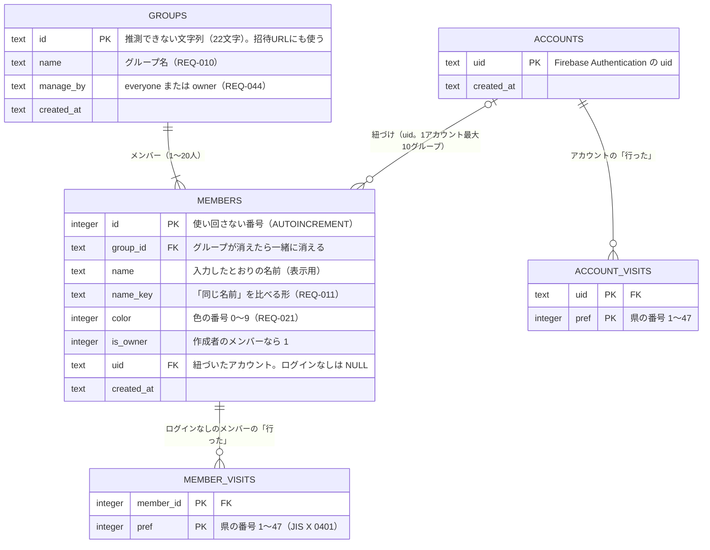

# データモデル

状態：下書き（2026-10-10：[ADR 0003](../adr/0003-backend-selection.md) が案 C（Cloudflare Workers＋Hono＋D1、認証だけ Firebase Authentication）に決まったので、Firestore の版から D1 の版に書き直した。元の版は git の履歴にある。形は [spike/migrations/0001_init.sql](../../spike/migrations/0001_init.sql) の試作をもとにし、試作から変えたところは「試作からの変更」に書いた。2026-10-10 にユーザーと決めた：作成者はメンバーの印 `is_owner` で持つ（[ADR 0005](../adr/0005-owner-flag-on-member.md)）、メールアドレスは D1 に持たない、色は10色、紐づいたメンバーは本人だけが操作できる（Q-018）。同じ日の `/review-docs`（26件）を反映）

## 考え方

- データの正本は D1（SQLite）の1か所。リアルタイムの部屋（Durable Objects）は「変わったこと」を配るだけで、データを持たない（[ADR 0003](../adr/0003-backend-selection.md) の「リアルタイムの共有」）
- 画面を改造されても破られたくない決まり（NFR-006）は、できるだけデータベースの制約（`NOT NULL`・`CHECK`・`UNIQUE`・外部キー・トリガー）に持たせる。制約で書けないものは API の1つの SQL か batch の中で判断する（D1 には途中で他の人を待たせるトランザクションがないため）
- **batch が取り消されるのはエラーのときだけ**。条件付きの `UPDATE` や `INSERT … SELECT … WHERE` が0行でも成功として扱われ、batch の残りは実行される。そのため、batch の中で「前の文が成功したときだけ」動かしたい文には、前の文の結果を `WHERE EXISTS (…)` で確かめる条件を付けるか、断りたい場面をトリガーでエラーにする
- 同じ事実を2か所に持たない（片方だけ古くなると抜け道になる：[learnings](../learnings/2026-10-02-owner-and-slot-lifecycle.md)）
- 個人情報は要るものだけ持つ（NFR-007）

## ER図

県の名前と地図の形は、データベースに持たず画面に埋め込む。

## テーブル

列はすべて `NOT NULL`（`members.uid` だけは除く）。SQLite では `CHECK` に `NULL` を入れても違反にならず、普通の表の複合の主キーも `NULL` を許すため、`NOT NULL` を書かないと空の行が入りうる。

### groups（グループ）

| 列 | 型 | 決まり | 要件 |
|---|---|---|---|
| `id` | TEXT | 主キー。英数字22文字（約128ビット）。`crypto.getRandomValues` で取り、62種類に割り切れない値は捨てて引き直す（偏りを出さない。試作は偏りを許していた）。`CHECK (length(id) >= 20)` | NFR-005 |
| `name` | TEXT | `CHECK (length(name) BETWEEN 1 AND 400)`。見た目の1〜20文字は API で数える。ここは大量のデータを書かれないための、余裕のある上限 | REQ-010、NFR-006 (8) |
| `manage_by` | TEXT | `DEFAULT 'everyone' CHECK (manage_by IN ('everyone', 'owner'))` | REQ-044 |
| `created_at` | TEXT | 作った日時（UTC の ISO 8601） | NFR-010 |

作成者はこの表に持たない（下の「作成者」）。

名前の長さの上限について：SQLite の `length()` は見た目の文字数ではなく、文字を作る部品（コードポイント）の数を数える。家族の絵文字のように、見た目は1文字でも7つ以上の部品からできている文字があるので、見た目の文字数の上限（名前10、グループ名20）の約20倍を保存の上限にする（2026-10-10 にユーザーと決めた）。

### members（メンバー）

| 列 | 型 | 決まり | 要件 |
|---|---|---|---|
| `id` | INTEGER | 主キー。`AUTOINCREMENT` で、消したメンバーの番号を使い回さない | REQ-025、REQ-052 |
| `group_id` | TEXT | `REFERENCES groups (id) ON DELETE CASCADE` | REQ-047 |
| `name` | TEXT | 入力したとおり（前後の空白は API で取る）。`CHECK (length(name) BETWEEN 1 AND 200)`。見た目の1〜10文字は API で数える | REQ-009、NFR-006 (8) |
| `name_key` | TEXT | 比べる形。API で NFKC にそろえてから小文字にする（NFKC で長くなる文字がある：「㍻」→「平成」）。`CHECK (length(name_key) BETWEEN 1 AND 200)` | REQ-011 |
| `color` | INTEGER | 色の番号。`CHECK (color BETWEEN 0 AND 9)`（10色）。下の「色」 | REQ-021 |
| `is_owner` | INTEGER | `DEFAULT 0 CHECK (is_owner IN (0, 1))` | REQ-052 |
| `uid` | TEXT | `REFERENCES accounts (uid) ON DELETE CASCADE`。ログインなしは `NULL`（空の文字にしない）。これだけ `NULL` を許す | REQ-037、REQ-036 |
| `created_at` | TEXT | 参加した日時 | — |

制約と索引：
- `UNIQUE (group_id, name_key)`：1つのグループで同じ名前は1人だけ（NFR-006 (11)）
- `UNIQUE (group_id, uid)`：1つのグループで、1つのアカウントに紐づくメンバーは1人だけ（NFR-006 (9)）。`NULL` どうしは重複とみなされないので、ログインなしのメンバーは何人でもよい
- `CREATE UNIQUE INDEX … ON members (group_id) WHERE is_owner = 1`：作成者のメンバーは1グループに1人まで（NFR-006 (4)）。部分インデックスは D1 の公式に例があるが、`UNIQUE` 付きの例はない（要確認：トリガーと一緒に試す）
- `CREATE INDEX … ON members (uid)`：アカウントからメンバーを引く（10グループの上限、グループ一覧、退会、全グループの部屋への知らせ）。`UNIQUE (group_id, uid)` は `group_id` が先なので、`uid` だけの検索には使えない
- トリガー（D1 で使えると明言した公式の記述はない：要確認。Phase 2 の最初に本物の D1 で `CREATE TRIGGER` と `RAISE(ABORT)` を試す。使えなければ、同じことを API のテストで守る）：
  - `is_owner` の `UPDATE` は断る（`RAISE(ABORT)`）。作成者の印を後から付けたり外したりできない（NFR-006 (4)、REQ-051）
  - `is_owner = 1` の `INSERT` は、同じグループにほかのメンバーがいれば断る。印が付くのはグループを作るときの最初のメンバーだけになり、作成者がいなくなった後に印付きのメンバーを入れて作成者を復活させることができない
  - `uid` を入れる `INSERT`・`UPDATE` は、同じ `uid` のメンバーがすでに10いれば断る（Q-032、REQ-060）。エラーにすることで、上限で断ったときに batch の残りも取り消される

### member_visits（ログインなしのメンバーの「行った」）

| 列 | 型 | 決まり |
|---|---|---|
| `member_id` | INTEGER | `REFERENCES members (id) ON DELETE CASCADE` |
| `pref` | INTEGER | `CHECK (pref BETWEEN 1 AND 47)` |

主キーは `(member_id, pref)`。1県1行。押し直しても結果が変わらず、別の県を同時に塗っても消し合わない（NFR-009）。

紐づいたメンバーは、この表に行を持たない（紐づけるときに消す。下の「紐づけ」）。そのため、付け外しは「紐づいていないこと」を同じ SQL の中で確かめる（下の「行った」の付け外し）。

### accounts（アカウント）

| 列 | 型 | 決まり |
|---|---|---|
| `uid` | TEXT | 主キー。Firebase Authentication の `uid`。`CHECK (length(uid) BETWEEN 1 AND 128)` |
| `created_at` | TEXT | 行を作った日時 |

ログインした人（確認済み）がグループを作る・参加する・紐づける・「行った」を保存するときに、API が `INSERT … ON CONFLICT (uid) DO NOTHING` で作る（`members.uid` の外部キーの先なので、メンバーより先に要る）。**メールアドレスは持たない**（下の「メールアドレス」）。

### account_visits（アカウントの「行った」）

| 列 | 型 | 決まり |
|---|---|---|
| `uid` | TEXT | `REFERENCES accounts (uid) ON DELETE CASCADE` |
| `pref` | INTEGER | `CHECK (pref BETWEEN 1 AND 47)` |

主キーは `(uid, pref)`。ログインしている人の「行った」の正本で、全グループで共有する（REQ-030）。メンバーには写さない。グループの地図を出すときは、紐づいたメンバーなら `account_visits` を、そうでなければ `member_visits` を読んで合わせる（下の「グループを開く」）。

## 設計のポイント

### 作成者

**作成者のメンバーに `is_owner = 1` を付ける**（2026-10-10 にユーザーと決めた：[ADR 0005](../adr/0005-owner-flag-on-member.md)。試作と [ADR 0003](../adr/0003-backend-selection.md) の「C で書き直すときの方針」は `groups.owner_member_id` だった）。

- 作成者のメンバーが消えれば（退出、削除、退会、グループの削除）、印も一緒に消える。「作成者がいなくなる」（REQ-051）を、消すときに何もしなくても守れる
- 印はメンバーの行にあるので、**別のグループのメンバーが作成者になることが、形の上で起きない**
- `groups` と `members` がお互いを指す（循環する外部キー）こともなくなる
- 印を付けるのはグループを作るときだけ。後から付ける・外すことは、トリガーで断る（上の「制約と索引」）
- 「作成者のみ」が効くかは `manage_by = 'owner'` かつ「`is_owner = 1` のメンバーがいる」で計算する。作成者がいなくなったら、`manage_by` を書き換えなくても「誰でも」として扱う（REQ-051）
- 作成者のメンバーに紐づければ、自分で作っていないグループの作成者にもなれる（REQ-037・REQ-043）

場面ごとの確かめ（[learnings](../learnings/2026-10-02-owner-and-slot-lifecycle.md) の表）：

| 場面 | どうなるか |
|---|---|
| 生まれる | グループを作るときに、最初のメンバーに付く（REQ-001） |
| 紐づける | 作成者のメンバーに紐づけると、ログインした本人が作成者として設定を変えられる（REQ-037）。印は動かない |
| 消える | 本人の退出・他の人による削除・退会・グループの削除のどれでも、メンバーの行と一緒に消える |
| 使い回される | 番号を使い回さないので、後から入った人が作成者になることはない。同じ名前で入り直しても新しいメンバーで、印は付かない（試作で確かめたのは `owner_member_id` の形〔済：ローカル〕。`is_owner` とトリガーの形は Phase 2 でテストする〔未〕） |
| 別の入口から来る（ログインなし） | 作成者の名前で入れば、作成者のメンバーとして操作できる（信頼ベース：REQ-052）。ただし管理できる人を変えるのはログインしている作成者だけ（REQ-045） |
| 別の入口から来る（別の端末で別の名前） | 作成者が別の端末から別の名前で入り、そちらをアカウントに紐づけると、作成者の印はログインなしの元のメンバーに残る（REQ-039）。本人はログインしても「作成者のみ」の設定を変えられない。受け入れる：元のメンバーで入り直してから紐づけ直す手はない（1グループ1アカウント1メンバー）が、元のメンバーを残したまま「誰でも」の操作はできる。requirements の「分かっている限界」に書く |
| 別の入口から来る（ログアウトした） | 紐づいた作成者のメンバーは、ログインなしでは入れない（REQ-013・REQ-035）。ログインし直せば作成者のまま |
| 別の入口から来る（退会のやり直し） | 退会で D1 を消した後、Firebase のアカウントの削除に失敗して同じ `uid` で戻ってきても、メンバーは消えているので作成者ではない |

### 色

- 10色（2026-10-10 にユーザーと決めた。モックは6色だった）。番号 0〜9 と実際の色の対応は画面が持つ
- 参加したときに、同じグループで使われていない番号の小さい順に決める。10色すべて使われていれば、使っている人が一番少ない番号（同じなら小さい番号）にする（REQ-021）
- 参加の SQL の中で決める。2人がほぼ同時に入ると同じ色になることがあるが、重複は許しているので受け入れる
- 色を変える API は作らない

### メールアドレス

**D1 にはメールアドレスを持たない**（2026-10-10 にユーザーと決めた）。Firebase Authentication がすでに持っていて、マイページ（REQ-033）は画面が Firebase の SDK から読める。API が要るときは ID トークンの `email` と `email_verified` を見る。D1 に写すと、変えたときや退会のときに2か所を直す必要が出て、漏れたときの影響も広がる。

問い合わせのフォーム（NFR-018）の返信先は、フォームに入れてもらう（ログインしていない人も使うため。表の形は Phase 2 で決める）。

### ログインしている人の扱い（API の共通の決まり）

- API は ID トークンを確かめ、`email_verified` が true（Google は確認済み）のときだけ、その `uid` を「ログイン済みの人」として使う。確認待ちの人や、トークンのない人は、ログインなしとして扱う（NFR-006 (10)、REQ-057）
- 確認済みかを見るのは、`uid` を使う API すべて：グループを作る、参加する、紐づける、アカウントの「行った」の付け外し、名前の変更、管理できる人の変更、管理の操作（作成者として）、退会
- **メンバーの番号で操作する API はすべて、そのメンバーが紐づいていれば、ログイン済みの人の `uid` と一致するときだけ通す**（2026-10-10 にユーザーと決めた：Q-018）。判断は書き込む SQL の `WHERE` に入れる：`WHERE id = ?番号 AND group_id = ?グループ AND (uid IS NULL OR uid = ?自分の uid)`（ログインなしの人は `?自分の uid` が `NULL` なので、紐づいていないメンバーだけに当たる）。対象：「行った」の付け外し、退出
- ログインなしのメンバーは、本人を見分けられないので、名前で入れば誰でも退出させられる（信頼ベース。requirements の「分かっている限界」）
- 名前の変更（REQ-014・REQ-015）は、紐づいたメンバーの本人だけ：`WHERE id = ? AND group_id = ? AND uid = ?自分の uid`。ログインなしのメンバーの名前は誰も変えられない

### 「行った」の付け外し

1つの SQL で、紐づいていないことを確かめて書く（確かめる SQL と書く SQL に分けると、その間に紐づけが入ったときに、紐づいたメンバーに行が残る）。

- 付ける：`INSERT INTO member_visits (member_id, pref) SELECT ?, ? WHERE EXISTS (SELECT 1 FROM members WHERE id = ? AND group_id = ? AND uid IS NULL) ON CONFLICT (member_id, pref) DO NOTHING`
- 外す：`DELETE FROM member_visits WHERE member_id = ? AND pref = ? AND EXISTS (同じ条件)`
- `INSERT OR IGNORE` は使わない（[rules/sql.md](../../.claude/rules/sql.md)）
- ログインしている人は、`account_visits` に自分の `uid` で書く（メンバーの番号は使わない）

### 紐づけ

紐づけ（REQ-037〜REQ-040）は1つの batch で、**紐づける文を先に**置く。

1. `accounts` に行がなければ作る（`ON CONFLICT (uid) DO NOTHING`）
2. `UPDATE members SET uid = ?自分 WHERE id = ? AND group_id = ? AND uid IS NULL`（紐づいたメンバーを付け替えられない：NFR-006 (3)）。同じグループに自分のメンバーがすでにいれば `UNIQUE (group_id, uid)`、10グループに達していればトリガーで、エラーになり batch ごと取り消される
3. 「合算する」とき：G を U に足す。`INSERT INTO account_visits (uid, pref) SELECT ?自分, pref FROM member_visits WHERE member_id = ? AND EXISTS (SELECT 1 FROM members WHERE id = ? AND uid = ?自分) ON CONFLICT (uid, pref) DO NOTHING`
4. そのメンバーの `member_visits` を消す（3. と同じ `EXISTS` を付ける）

2. が0行（他の人が先に紐づけた）でもエラーにならないが、3.・4. は `EXISTS` で何もしない。API は batch の後に読み直して、紐づいたか・誰に紐づいているかで応答を分ける。テストで「2. が0行のとき 3.・4. が何もしない」を確かめる。

- REQ-038 の選び方（U が空・G が U に含まれる・それ以外）は画面が判断し、API には「合算する」か「捨てる」かだけを送る。U が空のときは合算と同じ
- 紐づける前に、API が `email_verified` を見る（確認待ちなら断る：NFR-006 (10)、[ADR 0003](../adr/0003-backend-selection.md) の基準の4）
- `UNIQUE (group_id, uid)` で失敗したら、API はそれを REQ-039 の案内に変える

### グループを作る

1つの batch：

1. ログイン済みなら `accounts` に行を作る（`ON CONFLICT DO NOTHING`）
2. `groups` を入れる
3. `members` に最初のメンバーを `is_owner = 1`、色 0、ログイン済みなら `uid` 付きで入れる。10グループに達していれば、トリガーでエラーになり、2. も取り消される（REQ-060）

### 参加する

1つの SQL で、グループがあること・20人未満であることを確かめて入れる（`INSERT … SELECT … WHERE EXISTS (…) AND (SELECT count(*) …) < 20`。REQ-005、NFR-006 (8)）。色の番号もこの SQL の中で決める。

- 名前の重複と1アカウント1メンバーは `UNIQUE` で失敗させ、API が理由を読み分ける
- ログイン済みなら、同じ batch の先に `accounts` の行を作り、`uid` 付きで入れる。10グループに達していればトリガーで断る（REQ-060）
- 0行なら、API が読み直して「グループがない」か「満員」かを分ける

### グループを開く

1回の batch で、グループ、メンバー、ログインなしのメンバーの「行った」、紐づいたメンバーのアカウントの「行った」を読む。最後の2つは、`members` と結合してそのグループの分だけを読む。

- 応答には、ほかのメンバーの `uid` を入れない。メンバーごとに「紐づいているか」と「自分か」だけを返す（`uid` を返すと、グループIDを知っている人が、別のグループにいる同じ人を照らし合わせられる：NFR-007）
- グループIDを知っている人なら、ログインなしでも読める（NFR-005 と同じ強さ。ログインなしの人は証明書を持たないので、API ではメンバーかどうかを見分けられない）

### 退出・削除・退会

- **退出**（REQ-049）・**メンバーの削除**（REQ-048）：メンバーを消すのと、「0人ならグループを消す」を同じ batch にする（REQ-050。Q-010）。「行った」は外部キーで一緒に消える。退出は上の「共通の決まり」の `WHERE`、削除は下の「管理できる人の操作」の `WHERE` で確かめる
- **グループの削除**（REQ-047）：`groups` の行を消せば、メンバーと `member_visits` が外部キーで消える。`account_visits` は残る
- **退会**（REQ-036）：1つの batch で、(1) 自分のメンバーしかいないグループを消す（`DELETE FROM groups WHERE id IN (SELECT group_id FROM members WHERE uid = ?) AND NOT EXISTS (SELECT 1 FROM members m WHERE m.group_id = groups.id AND (m.uid IS NULL OR m.uid <> ?))`）、(2) `accounts` の行を消す。(2) で、`account_visits` と、紐づいたメンバー（と作成者の印）が外部キーで消える。Firebase のアカウントの削除は、D1 を消した後に画面から行う（流れと `auth_time` の確かめは [auth-flow.md](auth-flow.md) の 5.）

### 管理できる人の操作

グループ名の変更、グループの削除、メンバーの削除は、`manage_by` と作成者を同じ SQL の `WHERE` で確かめる（NFR-006 (5)）。「作成者のみ」が効いているときは、`is_owner = 1` のメンバーの `uid` がログイン済みの人の `uid` と同じか、`is_owner = 1` のメンバーが紐づいておらず、その番号を送ってきたとき（ログインなしの作成者：信頼ベース、REQ-052）だけ通す。

`manage_by` を変える API は、ログイン済みの人の `uid` が `is_owner = 1` のメンバーの `uid` と同じときだけ通す（NFR-006 (4)(10)、REQ-045）。

## 保存先で守るもの（NFR-006）との対応

NFR-006 の「保存先」は、案 C では「API とデータベースの制約」と読む。画面の確認は改造で破れるので数えない。

| NFR-006 | 守る場所 |
|---|---|
| (1) 紐づいたメンバーの「行った」と名前は本人だけ | 「行った」はアカウントにあり、メンバーの番号では書けない（付け外しの SQL が `uid IS NULL` を確かめる）。名前の変更は `uid = 自分` の `WHERE` |
| (2) アカウントの「行った」は本人だけが書け、同じグループのメンバーが読める。メールアドレスは本人だけ | 書くのは自分の `uid` の行だけ（API）。読むのはグループを開くときの結合だけで、**グループIDを知っている人なら読める**（ログインなしの人がメンバーかは見分けられない。NFR-005 と同じ強さ）。メールアドレスは D1 に持たない |
| (3) 紐づけの付け替えをさせない | 条件付き `UPDATE`（`uid IS NULL` のときだけ書く） |
| (4) 管理できる人を変えるのはログインしている作成者だけ。作成者を勝手に変えられない | 部分 `UNIQUE` インデックス（作成者は1人）とトリガー（印を後から付け外しできない）。`manage_by` の変更は API で確かめる |
| (5) 「作成者のみ」のときの操作 | API の `WHERE` |
| (6) 自分のアカウントは自分しか消せない | API（ログイン済みの人の `uid` の行だけ消す。`auth_time` も確かめる） |
| (7) グループIDを知らなければ読めない、一覧できない | 推測できないID と、一覧する API を作らないこと |
| (8) 20人まで、名前の長さ | 20人は参加の SQL の `WHERE`、長さは `CHECK` |
| (9) 1グループ1アカウント1メンバー | `UNIQUE (group_id, uid)` |
| (10) 確認待ちのアカウントは、ログインありとして扱わない | API（ID トークンの `email_verified`。上の「共通の決まり」） |
| (11) 名前の重複 | `UNIQUE (group_id, name_key)` |

10グループの上限（Q-032、REQ-060）は NFR-006 には入っていないが、無料枠に響くのでトリガーで守る。

制約を足したら、違反がエラーになるテストを1つ書く（[rules/sql.md](../../.claude/rules/sql.md)）。API で守るものは、Phase 2 の Vitest で、改造した画面を想定したリクエストを送って確かめる。

## 持たないもの

- メールアドレス（上の「メールアドレス」）
- アカウントの表示名（REQ-007）
- 参加中のグループの一覧（`members` を `uid` で引けば分かる。二重に持たない）
- 最後に使った日時：利用状況の数え方（Q-025）が決まってから足す
- 問い合わせ（NFR-018）：Phase 2 で表を足す

## 試作からの変更

[spike/migrations/0001_init.sql](../../spike/migrations/0001_init.sql) から変えたところ。

- `groups.owner_member_id` をやめ、`members.is_owner` にした（上の「作成者」、[ADR 0005](../adr/0005-owner-flag-on-member.md)）
- `visits` を、ログインなしの `member_visits` と、アカウントの `account_visits` に分けた（試作はログインなしだけ）
- `accounts` を足し、`members.uid` をその外部キーにした（退会でメンバーが一緒に消える）
- `members.color`、`created_at`、`members (uid)` の索引、トリガーを足した
- 名前の長さの上限を 40 から 200（グループ名は400）にした
- `visits` の列と `groups.manage_by` に `NOT NULL` を足した

## 読み書きの回数の見積もり

D1 の Free の枠（2026-10-10 に `researcher` で公式を確認）：読み取り1日500万行、書き込み1日10万行（日本時間9時に戻る。超えたらエラーで止まり、請求はない）、1データベース500MB、1回の Worker の呼び出しで送れる SQL は50本まで（batch の中の文も数える）。書き込みは、変えた行の数に加えて、索引の分も数えられる。外部キーの `CASCADE` で消える行とトリガーが数えられるかは公式に記述がない（要確認：本物の D1 で `meta.rows_written` を見て確かめる。見積もりでは数えられるとみなす）。

- 読み取り：NFR-015 の規模で約10万行/日（約2%。ADR 0003 の見積もり）。グループを開くたびに読む行は、メンバー20人が全員30県を付けていても約620行。表を分けても変わらない。`members (uid)` の索引がないと、アカウントから引くたびに表をすべて読むことになる
- 書き込み：付け外し1回で、表の1行と主キーの索引で約2行。1日2,500回（ADR 0003 の仮定）で約5,000行。参加・紐づけ（合算は最大47行）・退会（`CASCADE` で最大 10グループ分のメンバーと47県）を足しても、1日1万行（約10%）に届かない見込み
- 1回の API で送る SQL は、どの操作も10本に届かない

出典：https://developers.cloudflare.com/d1/platform/pricing/ 、https://developers.cloudflare.com/d1/platform/limits/ 、https://developers.cloudflare.com/d1/best-practices/use-indexes/
