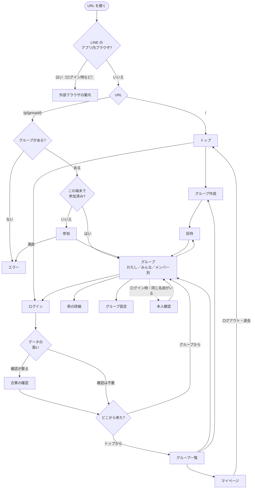

# 画面

状態：レビュー待ち（モックにある画面と、これから足す画面を含む。2026-10-02：ログアウト、退会、退出、名前の変更を要件定義の決定に合わせた）

## 画面一覧

| 画面 | 種類 | モック | 内容 |
|---|---|---|---|
| トップ | ページ | なし | アプリの説明、「グループを作る」、ログイン。ログアウトした後もここを開く。中身は要確認：Q-016（暫定：「グループを作る」「グループに参加する（招待URLを貼る）」） |
| グループ作成 | シート | あり | グループ名と自分の名前 |
| 参加 | シート | あり | 招待URLから開いたとき。名前を入力（ログインありも同じ）。端末の名前が見つからなかったときは「前回の名前が見つかりませんでした」。ログインしていた人への「ログインして入る」の案内 |
| 招待 | シート | あり | 招待URLの表示とコピー |
| グループ（わたし／みんな／メンバー別） | ページ | あり | 地図と一覧。アプリの中心 |
| 県の詳細 | シート | あり | その県に誰が行ったか |
| ログイン | ページ | なし | メール＋パスワード、Google、パスワードの再設定 |
| グループ一覧 | ページ | なし | ログイン時のみ。参加中のグループを切り替える |
| マイページ | ページ | なし | ログイン時のみ。アカウントの「行った」、メールアドレス、ログアウト、退会 |
| グループ設定 | シート | なし | グループ名、管理できる人（誰でも／作成者のみ）、メンバーの削除、グループの削除、退出、自分の名前の変更（ログインありのみ） |
| 退出の確認 | ダイアログ | なし | 最後のメンバーなら「グループも削除されます」 |
| 退会の確認 | ダイアログ | なし | 紐づいた各グループのメンバーも消えることを伝え、ログインし直してもらう |
| 合算の確認 | ダイアログ | なし | 「アカウントのデータを使う／合算する」 |
| 本人確認 | ダイアログ | なし | 「この人はあなたですか？」 |
| 外部ブラウザの案内 | ページ | なし | LINE のアプリ内ブラウザで開いたとき |
| エラー | ページ | なし | グループが見つからない、満員（20人）、通信エラー |

## 画面遷移図

## 画面のルール

- スマホ幅を基本にする（モックと同じ）
- 招待URLを LINE で開いても、`?openExternalBrowser=1` で外部ブラウザに移る
- ログインしていないときは、グループ一覧とマイページには入れない
