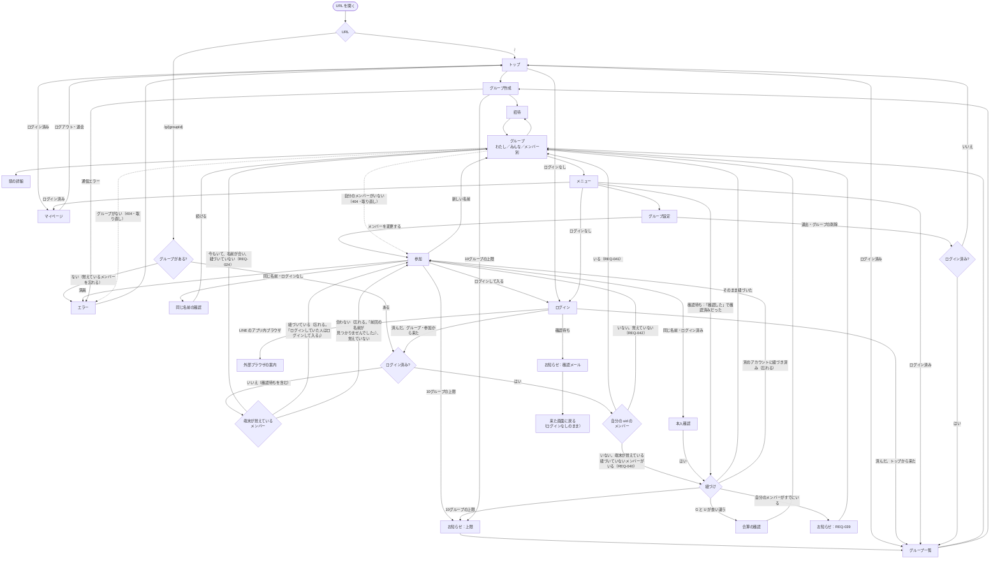

# 画面

状態：下書き（2026-10-11：Q-020 の `/review-docs`（21件）を受けて、遷移図をログインなし／ログイン済みと紐づけの分岐で書き直し、トップをログイン済みでも開ける入口にし、紐づけに失敗したとき、消されたことの気づき方（404 と部屋からの「取り直して」）、グループ設定の出し分け、失敗の文の分け方、参加の画面の出し分けを足した。2026-10-11：Q-020（画面遷移の抜け）をユーザーと決めて、メニュー、確認ダイアログ一式、操作の後に開く画面、知らせ（保存の失敗、いまは使えない、開いている画面で消されていたとき、リアルタイムが切れたとき、確認メールの待ち、REQ-039）、ログインの入口と戻り先、プライバシーポリシーと問い合わせの入口を足した。2026-10-10：同じ名前の確認と、10グループの上限のエラーを足した。2026-10-02：ログアウト、退会、退出、名前の変更、端末の名前の確認を要件定義の決定に合わせた）

> 2026-10-10 の注記：案 C（[ADR 0003](../adr/0003-backend-selection.md)）に決まったので、遷移図の「端末の枠」を「端末が覚えているメンバー」に直した

画面の配置や見た目はワイヤーフレーム（draw.io、これから作る）で決める。ここでは、どの画面があり、どこからどこへ移り、何を知らせるかを書く。文言は案で、Phase 3 で画面を作るときに整える。立場の言葉（ログインなし、確認待ち、ログイン済み）は [用語集](../glossary.md) と [権限マトリクス](permissions.md) にそろえる。

## 画面一覧

| 画面 | 種類 | モック | 内容 |
|---|---|---|---|
| トップ | ページ | なし | アプリの説明、「グループを作る」、「グループに参加する（招待URLを貼る）」。**ログイン済みでも開ける**。ログインの状態に合わせた入口を出す：ログインなしならログイン、確認待ちなら確認待ちの表示（下の「メニューの中身」と同じ）、ログイン済みならグループ一覧とマイページ（2026-10-11 にユーザーと決めた。素の HTML なので、状態に合わせた出し方は Q-016 で決める）。ログアウト・退会の後もここを開く |
| グループ作成 | シート | あり | グループ名と自分の名前。トップから開く。ログイン済みならグループ一覧からも開ける（REQ-001・REQ-032） |
| 参加 | シート | あり | 招待URLから開いたとき。グループ名と参加中のメンバーの名前を出し（REQ-002）、名前を入れてもらう。立場ごとの出し分けは下の「参加の画面」 |
| 招待 | シート | あり | 招待URLの表示とコピー |
| グループ（わたし／みんな／メンバー別） | ページ | あり | 地図と一覧。アプリの中心 |
| 県の詳細 | シート | あり | その県に誰が行ったか |
| メニュー | シート | なし | グループの画面のヘッダーから開く。中身は下の「メニューの中身」 |
| ログイン | ページ | なし | 「ログイン／アカウントを作る」の切り替え、メール＋パスワード、Google、パスワードの再設定。入口はトップ、メニュー、参加の3つ。LINE のアプリ内ブラウザで開いたら、外部ブラウザの案内を出す |
| グループ一覧 | ページ | なし | ログイン済みのみ。参加中のグループを切り替える。ここから新しいグループを作る |
| マイページ | ページ | なし | ログイン済みのみ（確認待ちの人は開けない）。アカウントの「行った」、メールアドレス、ログアウト、退会 |
| グループ設定 | シート | なし | 下の「グループ設定の中身」 |
| 確認ダイアログ | ダイアログ | なし | 退出、メンバーの削除、グループの削除、退会、合算、本人確認、同じ名前の確認。中身は下の「確認ダイアログ」 |
| お知らせ | ダイアログ | なし | OK を押すまで閉じないダイアログ。REQ-039、確認メール、10グループの上限 |
| 外部ブラウザの案内 | ページ | なし | ログインの画面を LINE のアプリ内ブラウザで開いたとき（Google ログインが使えないため。NFR-002） |
| エラー | ページ | なし | グループが見つからない（削除された）、満員（20人）、通信エラー、いまは使えない（NFR-012）。「トップへ」のボタンを置く |
| プライバシーポリシー | ページ | なし | 検索に出す素の HTML（NFR-008・NFR-019） |
| 問い合わせ | ページ | なし | 削除の依頼などのフォーム（NFR-018）。送り先はアプリの API |

アプリの画面（グループ、グループ一覧、マイページ、ログイン、エラー）は、どれもヘッダーからトップへ戻れる（遷移図では省く）。

## 画面遷移図

- ログインした後に「グループ・参加から来た」ときは、同じグループを開き直す（`IsLogin` に戻る）。ログインなしで入っていたメンバーは端末が覚えているので、`Mine` から紐づけに入る（REQ-037）
- 本人確認と同じ名前の確認は、参加の画面の中で出す

## 参加の画面

| | ログインなし・確認待ち | ログイン済み |
|---|---|---|
| グループ名と参加中のメンバーの名前（REQ-002） | ○ | ○ |
| 名前の入力 | ○ | ○ |
| 覚えていたメンバーが合わなかったとき | 「前回の名前が見つかりませんでした」（REQ-025） | —（ログイン済みは覚えている名前で入らない） |
| 覚えていたメンバーが紐づいていたとき | 「ログインしていた人はログインして入る」（REQ-025・REQ-035） | —（紐づけの「別のアカウントに紐づき済み」から来たときは「（名前）さんは、ほかのアカウントに紐づいています」） |
| 紐づいたメンバーと同じ名前を入れた（REQ-013） | 「この名前で入るにはログインが必要です」と、ログインへの入口 | 「この名前は、ほかのアカウントに紐づいています。別の名前を入れるか、そのアカウントでログインしてください」 |
| 紐づいていないメンバーと同じ名前を入れた | 同じ名前の確認（REQ-012） | 本人確認（REQ-043） |
| ログインへの入口 | ○（確認待ちには出さない） | — |

## メニューの中身

グループの画面のヘッダーから開く（モックの「自分の名前」のボタンの位置。配置はワイヤーフレームで決める）。

| 項目 | ログインなし | 確認待ち | ログイン済み |
|---|---|---|---|
| グループ設定 | ○ | ○ | ○ |
| ログイン | ○ | — | — |
| 確認待ちの表示（下） | — | ○ | — |
| グループ一覧、マイページ | — | — | ○ |
| トップ、プライバシーポリシー、問い合わせ | ○ | ○ | ○ |

**確認待ちの表示**（REQ-057。2026-10-11 にユーザーと決めた）：確認待ちの人は、API からはログインなしと同じに見え、アカウントの「行った」も読めない（[権限マトリクス](permissions.md)）。そのため、マイページとグループ一覧は開けず、メニューとトップに次だけを出す。

- 「メールの確認待ち（（メールアドレス）宛て）」
- 「確認メールを再送する」
- 「確認した」：ID トークンを取り直し、確認が済んでいれば、開いているグループで端末が覚えているメンバーを紐づける（[auth-flow](auth-flow.md) の 2. の「確認メールが済んだ後」）。済んでいなければ「まだ確認が済んでいません」
- 「ログアウト」：打ち間違えたアドレスで登録したときは、ここから正しいアドレスでやり直せる

画面に戻ってきたとき（別のアプリから切り替えたとき）も、ID トークンを取り直して同じように確かめる。

## グループ設定の中身

「作成者のみ」が効くのは、作成者のメンバーがいるときだけ（REQ-051）。

| 項目 | ログインなし | 確認待ち | ログイン済み |
|---|---|---|---|
| グループ名の変更、グループの削除、メンバーの削除 | 「誰でも」なら出す。「作成者のみ」なら出さず、「作成者だけが変えられます」と一言出す | ログインなしと同じ | 「誰でも」なら出す。「作成者のみ」なら、自分が作成者のメンバー（紐づいた本人）のときだけ出す |
| 管理できる人（誰でも／作成者のみ） | いまの設定を見せるだけ | いまの設定を見せるだけ | 自分が作成者のメンバー（紐づいた本人）のときだけ切り替えられる（REQ-045）。ほかの人には見せるだけ |
| 退出 | ○ | ○ | ○ |
| 自分の名前の変更 | —（REQ-015） | — | ○（REQ-014） |
| メンバーを変更する（REQ-056） | ○ | —（使うと、確認が済んだ後に紐づける相手を忘れてしまうため） | — |

画面で出さないだけで、API と制約は [権限マトリクス](permissions.md) のとおりに断る。

## 確認ダイアログ

削除したものは戻せない（NFR-017）ので、消す操作は必ず確認する。消すボタンは赤にする。

| 操作 | 確認の中身 | 要件 |
|---|---|---|
| 退出 | 「（名前）として退出します。このグループでの『行った』は消えます。もう一度入るには招待URLが要ります［招待URLをコピー］」。ログイン済みなら「アカウントの『行った』は残ります」を足す。最後の1人なら「あなたが最後のメンバーです。グループも削除されます」（このときは作成者の注意は出さない）。最後の1人でない作成者のメンバーなら「このグループの作成者はいなくなり、戻せません」（「作成者のみ」なら「管理できる人は『誰でも』に変わります」も） | REQ-049〜REQ-051・REQ-039 |
| メンバーの削除 | 紐づいていないメンバー：「（名前）さんを削除します。その人のこのグループでの『行った』は消えます」。紐づいたメンバー：「（名前）さんを削除します。その人のアカウントの『行った』は残ります」。どちらも「招待URLを知っていれば、また参加できます」を足す。作成者のメンバーなら「このグループの作成者はいなくなり、戻せません」を足す（「誰でも」のときだけ起きる。「作成者のみ」では削除できるのは作成者だけで、自分は削除の一覧に出さないため）。自分は一覧に出さない（自分は「退出」を使う） | REQ-048・REQ-051 |
| グループの削除 | 「（グループ名）を削除します。全員（N人）のこのグループでの『行った』が消え、戻せません。ログインしているメンバーのアカウントの『行った』は残ります」。赤い「削除する」を押す（グループ名を打ち込ませるまではしない。2026-10-11 にユーザーと決めた） | REQ-047 |
| 退会 | 「アカウントとアカウントの『行った』を消します。紐づいた各グループからも退出します。取り消せません」と、紐づいたグループの一覧。最後の1人のグループには「グループも削除されます」、そうでない作成者のグループには「作成者がいなくなります」を添える。確認の後に、ログインし直してもらう | REQ-036・REQ-050・REQ-051 |
| 合算 | 「アカウントのデータを使う／合算する」。「アカウントのデータを使う」には「このグループでの入力は消えます」を添える | REQ-038 |
| 本人確認 | ログイン済みのとき：「この人はあなたですか？」 | REQ-043 |
| 同じ名前の確認 | ログインなしのとき：「（名前）さんはすでに参加しています。この人として続けますか？」（2026-10-10 に足した。モックは確かめずに入る） | REQ-012 |

「メンバーを変更する」（REQ-056）はメンバーを消さないので、確認を出さずに参加（名前の入力）に移る。

## 操作の後に開く画面

| 操作 | 開く画面 | 端末が覚えているメンバー |
|---|---|---|
| 退出、グループの削除 | ログイン済みならグループ一覧、ログインなしならトップ | そのグループのものを忘れる（忘れないと、次に開いたときに「前回の名前が見つかりませんでした」と出るため） |
| メンバーの削除（ほかの人） | グループ設定のまま | 変えない |
| ログアウト | トップ（REQ-034） | 忘れるかは要確認：Q-017 |
| 退会 | トップ（REQ-036） | 忘れるかは要確認：Q-017 |
| ログイン、アカウントを作る | 来た画面に戻る。グループや参加の画面から来たなら、そのグループを開き直す（[auth-flow](auth-flow.md) の 3. の流れ）。トップから来たならグループ一覧 | — |
| メンバーを変更する | 参加（名前の入力） | そのグループのものを忘れる（REQ-056） |
| 開いたグループが見つからない | エラー | そのグループのものを忘れる |
| 紐づけが10グループの上限で断られた | お知らせ（下）のあと、グループ一覧 | 残す（ほかのグループから退出した後に開けば、紐づけられる：REQ-040） |
| 紐づけが「別のアカウントに紐づき済み」で断られた | 参加（名前の入力） | 忘れる（REQ-025 と同じ） |

## 知らせ

| 場面 | 出し方 | 要件 |
|---|---|---|
| 「行った」の付け外し | 押したら仮の表示（塗り）にして送る。応答が来るまで、その県はもう押せないようにする（続けて押したときや、応答の順番が入れ替わったときに食い違わないため）。成功したら確定。失敗したら最後に保存できた状態に戻す（2026-10-11 にユーザーと決めた：端末に溜めて送り直すことはしない）。送っている間に、ほかの人の変更がリアルタイムで届いたら、それも反映する | NFR-009 |
| やり直せる失敗（通信エラー、一時的な 503） | 「保存できませんでした。もう一度お試しください」。付け外しなら上のとおり元に戻す | NFR-009 |
| やり直しても通らない失敗（同じ名前がいる、権限がない、満員） | 理由の文を出し（「同じ名前の人がいます」「作成者だけが変えられます」など）、グループを読み直す（設定が途中で変わっていることがあるため） | NFR-009 |
| いまは使えない（無料枠を超えた） | API は 503 に理由を付けて返す（枠切れか、一時的な失敗か：[data-model](data-model.md)）。JSON でない応答（Cloudflare のエラー画面）も枠切れとみなす（[architecture](architecture.md)）。読み込みが止まったら、エラーの画面に「いまは混み合っていて使えません。遅くとも翌朝9時ごろには戻ります」。書き込みが止まったら、同じ文を出し、付け外しは元に戻す。Durable Objects の枠切れは、下の「リアルタイムの知らせがつながらない」と同じ扱い。無料枠を超えたときに API が実際にどんなエラーを返すか（D1・Workers・Durable Objects それぞれ）は Phase 2 で確かめる（要確認） | NFR-012 |
| ID トークンを取り直しても 401 になる（別の端末で退会した、など） | 「ログインし直してください」と出してログアウトし、トップを開く（ログインなしに落として続けない：[権限マトリクス](permissions.md)） | NFR-006 |
| グループが削除されていた | 書き込みが 404、または部屋から「取り直して」が届いて読み直したら見つからない。「このグループは削除されました」と出し、エラーの画面に移る | REQ-006 |
| 自分のメンバーが削除されていた | 書き込みが 404、または読み直したら自分のメンバーがいない。「（名前）さんはグループから削除されました」と出し、覚えているメンバーを忘れて参加（名前の入力）に移る | REQ-048 |
| リアルタイムの知らせが数秒以上つながらない | 画面の上に細い帯で「自動で更新されていません［読み直す］」と出す。つながったら消す（会議の場では、画面が自動で変わる前提で見ているため）。つなぎ直す間隔はだんだん長くし（最大60秒）、続けて失敗してもつなぎ続けない（部屋への接続も Durable Objects の回数に数えるため。Q-031） | NFR-003 |
| アカウントを作った（メール＋パスワード） | お知らせ：「確認のメールを送りました。確認が済むまでは、ログインなしのままお使いいただけます」。以後はメニューとトップに確認待ちの表示 | REQ-057 |
| 確認待ちのまま、もう一度ログインした | お知らせ：「メールアドレスの確認が済んでいません」と「確認メールを再送する」 | REQ-057 |
| 開いたグループに、自分のアカウントのメンバーがすでにいた | お知らせで REQ-039 の文。1度出したら、覚えているメンバーを紐づいたメンバーに切り替え、次からは出さない | REQ-039 |
| 10グループの上限（参加、グループ作成、紐づけ） | お知らせ：「アカウントに紐づけられるのは10グループまでです。ほかのグループから退出すると、紐づけられます」。OK でグループ一覧に移る（2026-10-11 にユーザーと決めた）。紐づけで断られたグループは、紐づけられるまでログイン中は開けない（ログアウトすれば、ログインなしのメンバーとして使える） | REQ-060 |

## 画面のルール

- スマホ幅を基本にする（モックと同じ）
- 招待URLを LINE で開いても、`?openExternalBrowser=1` で外部ブラウザに移る。ログインの画面だけは、アプリ内ブラウザで開かれたら外部ブラウザの案内を出す（NFR-002）
- ログインしていないとき（確認待ちを含む）は、グループ一覧とマイページには入れない
- どの画面も、一番下に「プライバシーポリシー・お問い合わせ」の小さなリンクを置く（NFR-008 の「1回の操作で開ける」。地図の画面では一覧の下。メニューにも置く。2026-10-11 にユーザーと決めた）。OK を押すまで閉じないお知らせの間は押せないが、OK で閉じればすぐ押せるので、対象外とする
- 名前、メールアドレスを入れる画面（グループ作成、参加、ログイン、問い合わせ）には、入れたものの使い道を一言添える（NFR-008）
