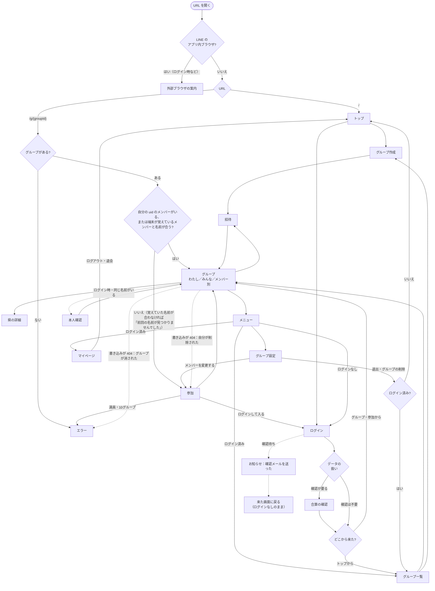

# 画面

状態：下書き（2026-10-11：Q-020（画面遷移の抜け）をユーザーと決めて、メニュー、確認ダイアログ一式、操作の後に開く画面、知らせ（保存の失敗、いまは使えない、開いている画面で消されていたとき、リアルタイムが切れたとき、確認メールの待ち、REQ-039）、ログインの入口と戻り先、プライバシーポリシーと問い合わせの入口を足した。2026-10-10：同じ名前の確認と、10グループの上限のエラーを足した。モックにある画面と、これから足す画面を含む。2026-10-02：ログアウト、退会、退出、名前の変更、端末の名前の確認を要件定義の決定に合わせた）

> 2026-10-10 の注記：案 C（[ADR 0003](../adr/0003-backend-selection.md)）に決まったので、遷移図の「端末の枠」を「端末が覚えているメンバー」に直した

画面の配置や見た目はワイヤーフレーム（draw.io、これから作る）で決める。ここでは、どの画面があり、どこからどこへ移り、何を知らせるかを書く。文言は案で、Phase 3 で画面を作るときに整える。

## 画面一覧

| 画面 | 種類 | モック | 内容 |
|---|---|---|---|
| トップ | ページ | なし | 暫定：アプリの説明、「グループを作る」、「グループに参加する（招待URLを貼る）」、ログイン。ログアウトした後もここを開く（要確認：Q-016） |
| グループ作成 | シート | あり | グループ名と自分の名前。ログインなしならトップから、ログイン済みならグループ一覧から開く（REQ-001・REQ-032） |
| 参加 | シート | あり | 招待URLから開いたとき。名前を入力（ログインありも同じ）。端末の名前が見つからなかったときは「前回の名前が見つかりませんでした」。ログインしていた人への「ログインして入る」の案内と、ログインへの入口 |
| 招待 | シート | あり | 招待URLの表示とコピー |
| グループ（わたし／みんな／メンバー別） | ページ | あり | 地図と一覧。アプリの中心 |
| 県の詳細 | シート | あり | その県に誰が行ったか |
| メニュー | シート | なし | グループの画面のヘッダーから開く。中身は下の「メニューの中身」 |
| ログイン | ページ | なし | 「ログイン／アカウントを作る」の切り替え、メール＋パスワード、Google、パスワードの再設定。入口はトップ、メニュー、参加の3つ |
| グループ一覧 | ページ | なし | ログイン済みのみ。参加中のグループを切り替える。ここから新しいグループを作る |
| マイページ | ページ | なし | ログイン済みのみ（確認待ちの人は開けない）。アカウントの「行った」、メールアドレス、ログアウト、退会 |
| グループ設定 | シート | なし | グループ名、管理できる人（誰でも／作成者のみ）、メンバーの削除、グループの削除、退出、自分の名前の変更（ログインありのみ）、メンバーを変更する（ログインなしのみ。REQ-056） |
| 確認ダイアログ | ダイアログ | なし | 退出、メンバーの削除、グループの削除、退会、合算、本人確認、同じ名前の確認。中身は下の「確認ダイアログ」 |
| お知らせ | ダイアログ | なし | REQ-039 のお知らせ、確認メールを送ったこと。OK を押すまで閉じない |
| 外部ブラウザの案内 | ページ | なし | LINE のアプリ内ブラウザで開いたとき |
| エラー | ページ | なし | グループが見つからない（削除された）、満員（20人）、10グループの上限（REQ-060）、通信エラー、いまは使えない（NFR-012） |
| プライバシーポリシー | ページ | なし | 検索に出す素の HTML（NFR-008・NFR-019） |
| 問い合わせ | ページ | なし | 削除の依頼などのフォーム（NFR-018）。送り先はアプリの API |

## 画面遷移図

## メニューの中身

グループの画面のヘッダーから開く（モックの「自分の名前」のボタンの位置。配置はワイヤーフレームで決める）。

| 項目 | ログインなし | 確認待ち | ログイン済み |
|---|---|---|---|
| グループ設定 | ○ | ○ | ○ |
| ログイン | ○ | — | — |
| メールの確認待ちの表示（下） | — | ○ | — |
| グループ一覧、マイページ | — | — | ○ |
| プライバシーポリシー、問い合わせ | ○ | ○ | ○ |

**確認待ちの表示**（REQ-057。2026-10-11 にユーザーと決めた）：確認待ちの人は、API からはログインなしと同じに見え、アカウントの「行った」も読めない（[権限マトリクス](permissions.md)）。そのため、マイページとグループ一覧は開けず、メニューに次だけを出す。

- 「メールの確認待ち（（メールアドレス）宛て）」
- 「確認メールを再送する」
- 「確認した」：ID トークンを取り直し、確認が済んでいれば、開いているグループのメンバーを紐づける（[auth-flow](auth-flow.md) の 2. の「確認メールが済んだ後」）
- 「ログアウト」：打ち間違えたアドレスで登録したときは、ここから正しいアドレスでやり直せる

画面に戻ってきたとき（別のアプリから切り替えたとき）も、ID トークンを取り直して同じように確かめる。

## 確認ダイアログ

削除したものは戻せない（NFR-017）ので、消す操作は必ず確認する。消すボタンは赤にする。

| 操作 | 確認の中身 | 要件 |
|---|---|---|
| 退出 | 「（名前）として退出します。このグループでの『行った』は消えます」。ログイン済みなら「アカウントの『行った』は残ります」を足す。最後の1人なら「あなたが最後のメンバーです。グループも削除されます」。作成者のメンバーなら「このグループの作成者はいなくなり、戻せません」（「作成者のみ」なら「管理できる人は『誰でも』に変わります」も） | REQ-049〜REQ-051 |
| メンバーの削除 | 「（名前）さんを削除します。その人のこのグループでの『行った』は消えます。招待URLを知っていれば、また参加できます」。作成者のメンバーなら、退出と同じ注意を足す。削除の一覧には自分を出さない（自分は「退出」を使う） | REQ-048・REQ-051 |
| グループの削除 | 「（グループ名）を削除します。全員（N人）のこのグループでの『行った』が消え、戻せません。ログインしているメンバーのアカウントの『行った』は残ります」。赤い「削除する」を押す（グループ名を打ち込ませるまではしない。2026-10-11 にユーザーと決めた） | REQ-047 |
| 退会 | 「アカウントとアカウントの『行った』を消します。取り消せません」と、紐づいたグループの一覧。最後の1人のグループには「グループも削除されます」、作成者のグループには「作成者がいなくなります」を添える。確認の後に、ログインし直してもらう | REQ-036・REQ-050・REQ-051 |
| 合算 | 「アカウントのデータを使う／合算する」 | REQ-038 |
| 本人確認 | ログイン済みのとき：「この人はあなたですか？」 | REQ-043 |
| 同じ名前の確認 | ログインなしのとき：「（名前）さんはすでに参加しています。この人として続けますか？」（2026-10-10 に足した。モックは確かめずに入る） | REQ-012 |

「メンバーを変更する」（REQ-056）はメンバーを消さないので、確認を出さずに参加（名前の入力）に移る。

## 操作の後に開く画面

| 操作 | 開く画面 | 端末の記憶 |
|---|---|---|
| 退出、グループの削除 | ログイン済みならグループ一覧、ログインなしならトップ | そのグループの記憶を消す（消さないと、次に開いたときに「前回の名前が見つかりませんでした」と出るため） |
| メンバーの削除（ほかの人） | グループ設定のまま | 変えない |
| ログアウト | トップ（REQ-034） | 消すかは要確認：Q-017 |
| 退会 | トップ（REQ-036） | 消すかは要確認：Q-017 |
| ログイン、アカウントを作る | 来た画面に戻る。参加の画面から来たなら、そのグループを開き、[auth-flow](auth-flow.md) の 3. の流れに入る。トップから来たならグループ一覧 | — |
| メンバーを変更する | 参加（名前の入力） | そのグループの記憶を消す（REQ-056） |

## 知らせ

| 場面 | 出し方 | 要件 |
|---|---|---|
| 「行った」の保存に失敗した（通信エラー、混み合っている） | 付け外しは画面にすぐ出し、失敗したら元に戻して「保存できませんでした。もう一度タップしてください」と出す。画面に出ている「行った」は、いつも保存済みのものにする（つながるまで端末に溜めて送り直すことはしない。2026-10-11 にユーザーと決めた） | NFR-009 |
| 名前の変更など、ほかの書き込みに失敗した | その操作の画面のまま、同じ文を出す | NFR-009 |
| いまは使えない（無料枠を超えた） | 読み込みが止まったら、エラーの画面に「いまは混み合っていて使えません。翌日には戻ります」。書き込みが止まったら、保存の失敗と同じ形で同じ文を出す。無料枠を超えたときに API がどんなエラーを返すか（D1・Workers・Durable Objects それぞれ）は Phase 2 で確かめる（要確認） | NFR-012 |
| 開いている画面で、グループが削除されていた（書き込みが 404） | 「このグループは削除されました」と出し、エラーの画面に移る | REQ-006 |
| 開いている画面で、自分のメンバーが削除されていた（書き込みが 404） | 「（名前）さんはグループから削除されました」と出し、端末の記憶を消して参加（名前の入力）に移る | REQ-048 |
| リアルタイムの知らせが数秒以上つながらない | 画面の上に細い帯で「自動で更新されていません［読み直す］」と出す。つながったら消す（会議の場では、画面が自動で変わる前提で見ているため） | NFR-003 |
| アカウントを作った（メール＋パスワード） | お知らせのダイアログ：「確認のメールを送りました。確認が済むまでは、ログインなしのままお使いいただけます」。以後はメニューに確認待ちの表示 | REQ-057 |
| 開いたグループに、自分のアカウントのメンバーがすでにいた | お知らせのダイアログ（OK を押すまで閉じない）で REQ-039 の文。1度出したら、端末の記憶を紐づいたメンバーに切り替え、次からは出さない | REQ-039 |
| 10グループの上限 | エラーの画面、または紐づけのときはお知らせ（[auth-flow](auth-flow.md) の 2.・3.） | REQ-060 |

## 画面のルール

- スマホ幅を基本にする（モックと同じ）
- 招待URLを LINE で開いても、`?openExternalBrowser=1` で外部ブラウザに移る
- ログインしていないとき（確認待ちを含む）は、グループ一覧とマイページには入れない
- どの画面も、一番下に「プライバシーポリシー・お問い合わせ」の小さなリンクを置く（NFR-008 の「1回の操作で開ける」。地図の画面では一覧の下。メニューにも置く。2026-10-11 にユーザーと決めた）。名前やメールアドレスを入れる画面には、入れたものの使い道を一言添える（NFR-008）
