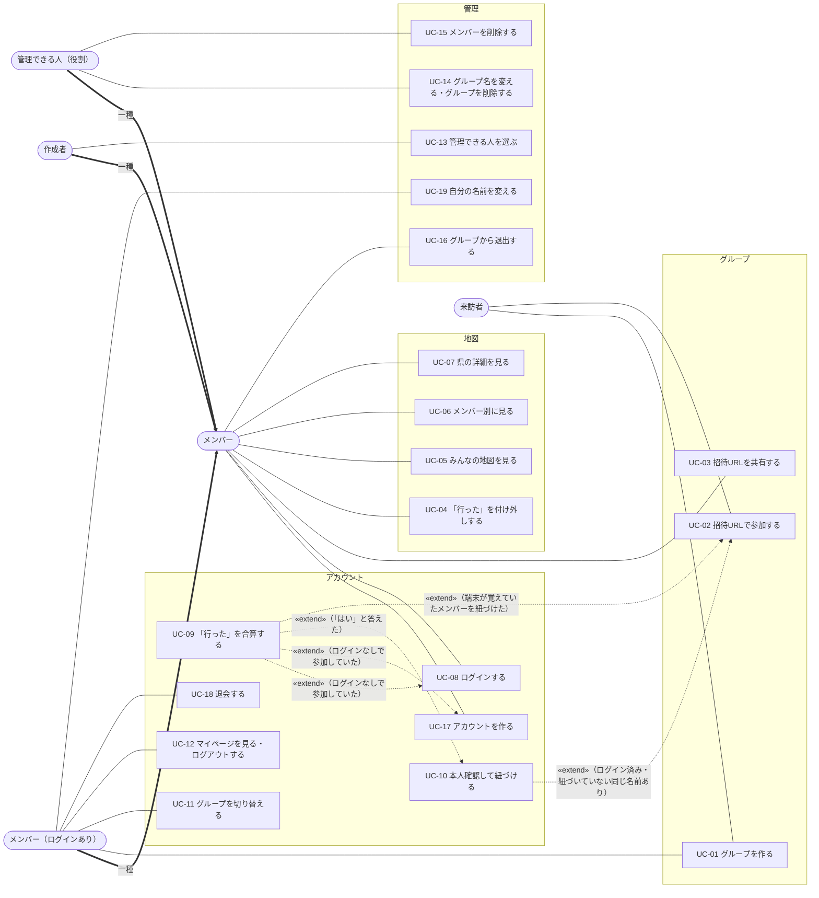

# ユースケース

状態：レビュー待ち（2026-10-11：Q-020 を決めて、UC-01 のアクターにログインしている人を足し、UC-14・UC-16・UC-18 に確認と操作の後に開く画面を足した。2026-10-11：権限マトリクスの `/review-docs`（14件）を受けて、UC-08 の REQ-039 の分岐に、作成者のメンバーのときの知らせを足した。2026-10-10：`/review-docs` を受けて、ログインなしでも同じ名前の確認を出す、10グループの上限、リアルタイムの備考、Q-018 の決定を反映した。ADR 0003 が案 C に決まったので、「枠」「匿名のときと同じ `uid`」の言葉を直した。2026-10-04：確定の後のレビュー（22件）で、確認メール・同じメールのアカウント・共用の端末などを足したため、レビュー待ちに戻した。その前：確定の前の再レビュー（18件）を反映し、ユーザーと決めて確定した。以下はそれまでの経緯。2026-10-02：未決事項 Q-001〜Q-009 の決定、図の書き方の直し（Q-015）、`/review-docs` の指摘を反映。2026-10-03：requirements のレビューで決めたこと（片方しか紐づけない、他のグループの紐づけ、メンバーを変更する）を反映）

「誰が何をするか」を洗い出した一覧。ここから機能要件（REQ-xxx）を起こした（[requirements.md](requirements.md) の各要件の「UC」の列が、このユースケースとの対応）。言葉は [用語集](glossary.md) にそろえる。

## アクター（登場する人）

| アクター | 説明 |
|---|---|
| 来訪者 | まだグループに入っていない人。招待URLを LINE などで受け取って開く |
| メンバー（ログインなし） | 名前だけでグループに参加している人。会員登録はしていない |
| メンバー（ログインあり） | メール＋パスワードまたは Google でログインして参加している人 |
| 管理できる人 | UC-14・UC-15 を行えるメンバー。グループの設定（誰でも／作成者のみ）に従う。特別な人ではなく、メンバーの役割 |
| 作成者 | グループを作った人（作成者のメンバー）。ログインなし／あり、どちらでもなりうる。「管理できる人」の設定を持つ |

「メンバー（ログインなし）」と「メンバー（ログインあり）」は、ログインすると後者になる（同一人物）。以下で「メンバー」とだけ書いたら両方を指す。

## ユースケース図

図の読み方：

- 形は UML と違う。丸い枠がアクター、四角がユースケース、枠（グループ・地図など）は分類
- 太い矢印「一種」：アクターの継承。たとえば作成者もメンバーなので、メンバーのユースケースはすべて行える
- 点線の矢印「«extend»」：矢印の元のユースケースが、条件を満たしたときだけ、矢印の先のユースケースの途中に割り込む。UC-09 と UC-10 は、利用者が単独で始めるのではなく、ログインや参加の途中で起こる
- 来訪者がトップからログインする場合（UC-08・UC-17）は、図では省いている

## ユースケース一覧

| ID | 名前 | アクター | ゴール |
|---|---|---|---|
| UC-01 | グループを作る | 来訪者、メンバー（ログインあり） | グループ名と自分の名前を入れて、グループと招待URLを得る |
| UC-02 | 招待URLで参加する | 来訪者 | 招待URLを開き、名前を入れてグループに入る |
| UC-03 | 招待URLを共有する | メンバー | 招待URLをコピーして LINE などで友達に送る |
| UC-04 | 「行った」を付け外しする | メンバー | 地図か一覧をタップして自分の「行った」を更新する |
| UC-05 | みんなの地図を見る | メンバー | 行った人が多い県と、全員まだ行っていない県を見て次の行き先の候補を見つける |
| UC-06 | メンバー別に見る | メンバー | 選んだ人の「行った」だけを見る |
| UC-07 | 県の詳細を見る | メンバー | 県をタップして、誰が行ったかを見る |
| UC-08 | ログインする | メンバー | 作ってあるアカウントに、メール＋パスワードまたは Google でログインする（パスワードの再設定を含む） |
| UC-09 | 「行った」を合算する | （UC-02・UC-08・UC-10・UC-17 の途中で起こる） | グループとアカウントの「行った」が食い違うとき、確認して1つにする |
| UC-10 | 本人確認して紐づける | （UC-02 の途中で起こる） | ログインした人が入れた名前と同じ名前のメンバーがいるとき、自分かどうかを答えて紐づける／別の名前で入る |
| UC-11 | グループを切り替える | メンバー（ログインあり） | 参加中のグループの一覧から別のグループを開く |
| UC-12 | マイページを見る・ログアウトする | メンバー（ログインあり） | アカウントの「行った」とメールアドレスを確認し、ログアウトする |
| UC-13 | 管理できる人を選ぶ | 作成者 | 「誰でも」か「作成者のみ」を選ぶ（ログイン済みの作成者だけ） |
| UC-14 | グループ名を変える・グループを削除する | 管理できる人 | グループ名の変更、グループの削除 |
| UC-15 | メンバーを削除する | 管理できる人 | 他のメンバーをグループから外す |
| UC-16 | グループから退出する | メンバー | 自分のメンバーをグループから外す |
| UC-17 | アカウントを作る | メンバー | まだ使っていないメールアドレスか Google で、新しくアカウントを作る（新規登録） |
| UC-18 | 退会する | メンバー（ログインあり） | アカウントを削除し、紐づいていた各グループのメンバーも消す |
| UC-19 | 自分の名前を変える | メンバー（ログインあり） | グループでの自分の名前を変える |

## ユースケースの詳細

### UC-01 グループを作る
- 事前条件：なし（ログインなしでよい）
- 基本の流れ：トップで「グループを作る」→ グループ名と自分の名前を入力 → グループが作られ、作成者になる → 招待URLが表示される（UC-03）
- 代替の流れ：ログイン済み → グループ一覧から「グループを作る」。作成者のメンバーは最初から自分のアカウントに紐づく（REQ-001・REQ-032。2026-10-11：Q-020）
- 例外：通信エラー → エラー画面／ログイン済みで、すでに10グループに紐づいている → エラー（REQ-060）

### UC-02 招待URLで参加する
- 事前条件：招待URLを知っている
- 基本の流れ：URLを開く → 名前を入力 → メンバーになり、グループの地図が開く
- 代替の流れ：
  - 端末に前回の名前が残っている → 端末が覚えているメンバーと名前が、グループの今のメンバーと合い、アカウントに紐づいていなければ、名前を入力し直さずにそのまま開く。合わなければ（削除された、名前が変わった）端末の名前を消し、「前回の名前が見つかりませんでした」と出して名前の入力へ。覚えていたメンバーがアカウントに紐づいていたら（本人が別の端末で紐づけた場合も含む）、「ログインしていた人はログインして入る」と案内する。何をどこに覚えるかは（要確認：Q-017）
  - ログインなしで、端末が覚えている名前をやめたい（打ち間違えて他人として入った、1台を何人かで使う）→「メンバーを変更する」で端末の名前を忘れ、名前の入力に戻る。メンバーは消さない（REQ-056）
  - ログイン済みで、まだ自分のアカウントのメンバーはいないが、端末が覚えている紐づいていないメンバーがいる → 本人確認なしで紐づける。データは UC-09（REQ-040）。1台を何人かで使う端末では、前に別の人が入ったメンバーを紐づけてしまうことがある（requirements の「分かっている限界」。共用の端末では「メンバーを変更する」で記憶を消してもらう）
  - ログイン済みで、自分のアカウントに紐づいたメンバーがいる → そのまま開く
  - ログイン済みで、まだメンバーがいない → ログインなしと同じく名前を入力する（アカウントの表示名は使わない）。下の「同じ名前がすでにある場合」に従う
  - LINE のアプリ内ブラウザで開いた → 外部ブラウザに移る
- 例外：グループがない → エラー／満員（20人）→ エラー（新しいメンバーとして入るときだけ判定する。既存のメンバーとして入るときは人数に数えない）／ログイン済みで、すでに10グループに紐づいている → エラー（REQ-060）
- 同じ名前がすでにある場合（名前は1グループで、ログインあり・なしを問わず重複させない）：
  - 紐づいていないメンバーの名前 → ログインなしなら「この人として続けますか？」と確かめ、続けるならそのメンバーとして入る（2026-10-10。REQ-012）。ログイン済みなら UC-10
  - 紐づいたメンバー（ログインあり）の名前 → 入れず、別の名前を求める

### UC-03 招待URLを共有する
- 基本の流れ：招待の画面でURLをコピー（またはシェア）→ LINE に貼って送る
- 備考：再発行はしない（MVP）

### UC-04 「行った」を付け外しする
- 事前条件：メンバーである
- 基本の流れ：「わたし」で県をタップ（または一覧で選ぶ）→ 付け外しされ、保存される
- 備考：ログインなしならグループのメンバーごとに保存し、そのグループの誰でも編集できる。ログインありならアカウントに保存して全グループに同期し、本人しか編集できない

### UC-05 みんなの地図を見る／UC-06 メンバー別に見る／UC-07 県の詳細を見る
- 「みんな」：行った人が多い県ほど濃く塗り、全員まだ行っていない県を強調する
- 「メンバー別」：選んだ1人の「行った」だけを表示する。メンバーの色は参加したときに自動で決まる（使われていない色から順に。足りなければ重複する）。色を変える操作はない（MVP）
- 県をタップ：その県に行った人の一覧を見る
- 備考：他の人の「行った」の付け外しは、画面を開いている人どうしで数秒以内に見える（NFR-003）。参加・退出・名前の変更は、画面を開き直したときに反映されればよい

### UC-08 ログインする／UC-17 アカウントを作る
- 基本の流れ：ログインを選ぶ → メール＋パスワードまたは Google → ログイン済みになる
  - UC-17：まだ使っていないメールアドレスか Google なら、新しいアカウントになる。ログインなしで参加していたなら、そのメンバーを新しいアカウントに紐づける（UC-09 と同じ流れ。[auth-flow](design/auth-flow.md) の 2.）
  - UC-08：すでにアカウントがあるメールアドレスか Google なら、そのアカウントにログインする。同じメールアドレスなら、メール＋パスワードでも Google でも同じアカウントとして扱う（REQ-028。細かい挙動は要確認：auth-flow の「未確認のこと」）
- 分岐（UC-17、メール＋パスワード）：確認メールを送る。確認が済むまでは確認待ちで、ログインなしとして使い続ける（紐づけない）。その間、マイページとグループ一覧は開けず、メニューに確認待ちの表示（再送、確認した、ログアウト）を出す（[screens](design/screens.md)。2026-10-11：Q-020）。確認が済んだ後、元の端末でグループを開いたときに紐づける（REQ-057・REQ-040）
- 分岐：ログインなしで参加していたグループから来た場合、そのグループのメンバーを紐づけ、データの扱いは UC-09（メール＋パスワードなら、確認が済んでから）
- 分岐：開いていたグループに、すでに自分のアカウントに紐づいたメンバーがいる（別の端末で参加済み。例：`はなこ` で参加済みなのに、この端末では `はな` で入っていた）→ いま入っていたメンバー（`はな`）は紐づけず、ログインなしのメンバーとしてそのまま残す（「行った」も同期しない。作成者なら作成者のまま）。この端末は `はなこ` として開き直し、「`はな` はログインなしのメンバーとして残ります。要らなければ、管理できる人に削除してもらうか、ログアウトして `はな` で入り、退出してください」と知らせる。`はな` が作成者のメンバーなら、退出すると作成者が戻らないことと、`はなこ` で退出して `はな` で入り直せば紐づけられることを知らせる（REQ-039）。1つのグループで、1つのアカウントに紐づくメンバーは1人だけ（REQ-039）
- 分岐：ログインなしで複数のグループに参加していた端末でも、ログインしたときに紐づけるのは開いていたグループだけ。他のグループは、あとで開いたときに、端末が覚えているメンバーを本人確認なしで紐づける（データは UC-09。すでに自分のアカウントのメンバーがいれば上の分岐と同じ）。端末が覚えていなければ名前の入力から入る（同じ名前を入れれば UC-10）（REQ-040。端末に何を覚えるかは要確認：Q-017）
- 例外：パスワードを忘れた → 再設定／LINE のアプリ内ブラウザ → 外部ブラウザの案内（Google ログインが使えないため）
- 例外（UC-17）：すでに使われているメールアドレス → 登録済みかどうかが分かりにくい文を出す（REQ-058）／パスワードが8文字未満 → 作れない（REQ-059）

### UC-09 「行った」を合算する
- 事前条件：ログインなしで参加していた人がログインした（UC-08・UC-17）、ログインした後に、端末が覚えていたメンバーのグループを開いた（UC-02。REQ-040）、または UC-10 で「はい」と答えた
- 流れ：グループの「行った」（G）とアカウントの「行った」（U）を比べる
  - U が空 → 確認なしで G をアカウントに引き継ぐ
  - G が U にすべて含まれる → 確認なしで U を表示
  - それ以外 → 「アカウントのデータを使う」（G は破棄）か「合算する」（G と U を合わせる）を選ぶ
- 備考：合算すると参加中の他のグループにも反映される

### UC-10 本人確認して紐づける
- 事前条件：ログイン済みの人が、グループに入るときに入れた名前と同じ名前のメンバー（まだ誰のアカウントとも紐づいていない）がいる
- 流れ：「この人はあなたですか？」→ はい：紐づけ、データは UC-09 と同じ扱い／いいえ：別の名前を入力する。入れ直した名前も UC-02 の「同じ名前がすでにある場合」と同じく確かめる（紐づいていない同じ名前があれば、もう一度この確認）
- 注意：実際には本人かどうかを確かめていない（自己申告）。他人のメンバーを先に紐づけられるリスクがある。作成者のメンバーを紐づけた人は作成者になるが、これも信頼ベースの限界として受け入れる（「決定したこと」を参照）

### UC-11 グループを切り替える／UC-12 マイページ
- UC-11：参加中のグループの一覧（グループ一覧）から選んで開く。新しいグループを作る（UC-01）こともできる
- UC-12：アカウントの「行った」とメールアドレスを見る。アカウントは表示名を持たない（名前はグループごとに入れる）
- UC-12（ログアウト）：ログアウトするとトップを開く。グループ一覧とマイページには入れなくなる。元のグループを開くと、名前の入力から入る（ログインし直して入ることもできる）。紐づいたメンバーの名前ではログインなしで入れないので、参加の画面で「ログインしていた人はログインして入る」と案内する。トップの中身は（要確認：Q-016）

### UC-13〜15 管理
- UC-13：事前条件はログイン済みの作成者であること。管理できる人を「誰でも」（初期値）か「作成者のみ」に切り替える。作成者がいないグループでは、誰も切り替えられない
- UC-14：グループ名の変更、グループの削除。管理できる人だけができる。削除の前に、全員の「行った」が消えて戻せないことを確認する。削除した後は、ログイン済みならグループ一覧、ログインなしならトップを開く（[screens](design/screens.md)。2026-10-11：Q-020）
- UC-15：メンバーの削除。管理できる人だけができる。メンバーを削除してもアカウントの「行った」は消えない。作成者のメンバーを削除したら、作成者はいなくなり、管理できる人は「誰でも」に変わる（UC-16 と同じ）。メンバーの名前の変更は管理の操作ではない（UC-19）

### UC-16 グループから退出する
- アクター：メンバー
- 事前条件：自分のメンバーである
- 流れ：グループ設定などから「退出」→ 自分のメンバーがグループから消え、グループでの「行った」も消える（アカウントの「行った」は残る）
- 代替の流れ：自分が最後のメンバー → 「あなたが最後のメンバーです。グループも削除されます」と確認し、グループも削除する
- 退出した後：ログイン済みならグループ一覧、ログインなしならトップを開き、端末の記憶からそのグループを消す（[screens](design/screens.md)。2026-10-11：Q-020）
- 備考：管理できる人の設定に関係なく、自分のメンバーは自分で消せる。**作成者のメンバーが消えたら（退出、UC-15 の削除、UC-18 の退会）、作成者はいなくなり、管理できる人は「誰でも」に変わる**。以後、そのグループで「作成者のみ」には誰も変えられない。ログインなしのメンバーは本人を確かめられないので、名前で入れば誰でも退出させられる。紐づいたメンバーは本人しか退出させられない（2026-10-10 に Q-018 で決定）

### UC-18 退会する
- アクター：メンバー（ログインあり）
- 事前条件：ログイン済み
- 流れ：マイページで「退会」→ 確認（紐づいたグループを並べ、最後の1人のグループと作成者のグループには注意を添える：[screens](design/screens.md)）→ ログインし直す（アカウントの削除には直前のログインが必要なため）→ 紐づいていた各グループのメンバーを消す（UC-16 と同じ扱い）→ アカウントの「行った」とアカウントを消す → トップを開く
- 備考：あるグループで最後のメンバーだったら、そのグループも削除する。作成者だったグループは、作成者がいなくなり、管理できる人が「誰でも」に変わる

### UC-19 自分の名前を変える
- アクター：メンバー（ログインあり）
- 流れ：グループ設定などで自分の名前を変える。変えるのはそのグループでの名前だけ
- 例外：同じ名前のメンバーがいる（紐づいていないメンバーを含む）→ 変えられない
- 備考：ログインなしのメンバーの名前は、誰も変えられない（本人を区別できないため）。打ち間違えたら、退出して入り直す（グループでの「行った」は消える）か、ログインしてから変える

## 決定したこと

- **同じ名前を入れたとき**（UC-02。Q-004 の「名前は重複させない」案で確定）：名前は1グループで、ログインあり・なしを問わず重複させない（Q-004）。
  - 紐づいていない（名前だけの）メンバーの名前 → ログインなしなら、「この人として続けますか？」と確かめてから、そのメンバーとして入る（信頼ベース。2026-10-10 に確認を足した）。ログイン済みなら UC-10（本人確認）
  - 紐づいたメンバー（ログインあり）の名前 → ログインなしでも、別のログイン済みの人でも、その名前では入れない。別の名前を求める
- **名前の入力**（Q-003）：ログインありの人も、グループごとに名前を入れる。アカウントは表示名を持たない
- **名前の変更**（Q-002・Q-004）：変えられるのはログインありの本人だけ（UC-19）。ログインなしの名前は誰も変えられない。変えるときも重複は許さない
- **端末に残った名前が古いとき**（Q-002）：覚えているメンバーと名前が合い、アカウントに紐づいていなければそのまま開く。合わなければ名前の入力へ
- **ログアウトした後**（Q-001）：トップを開く。元のグループを開くと名前の入力から
- **ログインなしで複数のグループに入っていた端末でログインしたとき**（Q-005）：ログインしたときに紐づけるのは開いていたグループだけ。他のグループは、あとで開いたときに、端末が覚えているメンバーを本人確認なしで紐づける（2026-10-03 に決定。REQ-040）
- **メンバーの色**（Q-008）：参加したときに自動で割り当てる。変える操作はない（MVP）
- **作成者の決め方**：**作成者＝作成者のメンバー**。名前で入れば（ログインなしなら）作成者として操作できる。アカウントの `uid` ではなくメンバーで決め、`uid` は作成者のメンバーに紐づいたアカウントから引く（設計は data-model.md）
- **ログインなしの作成者がログインしたとき**（Q-009）：作成者のメンバーを紐づけた人が、作成者のアカウントになり、グループ設定（「作成者のみ」への切り替えなど）ができる。紐づけは自己申告なので、先に紐づけた人が作成者になり、ログインなしの間は乗っ取りの余地がある。ただし初期値の「誰でも」では、もともと誰でもメンバーやグループを削除できる。乗っ取りで増えるのは「作成者のみ」に変えて締め出せることだけなので、信頼ベースの限界として受け入れる
- **作成者のメンバーがいなくなったとき**（退出・削除・退会。レビュー #1）：作成者はいなくなり、管理できる人は「誰でも」に変わる。以後「作成者のみ」には誰も変えられない（UC-15・UC-16・UC-18）。作成者をデータでどう持つかは（要確認：Q-019）
- **1つのグループで、同じアカウントに2つのメンバーが紐づきそうなとき**（レビュー #3。2026-10-03 に見直し）：前から紐づいているほうだけを紐づけたままにし、もう片方はログインなしのメンバーとして残す（「行った」は同期しない。作成者なら作成者のまま）。要らなければ利用者が削除する（UC-08 の分岐、REQ-039）
- **退出したメンバーの「行った」**：グループから消す。ログインありなら、アカウントの「行った」は消えない
- **メンバーが0人になったとき**（Q-007）：最後の1人が退出するときに確認し、グループも削除する
- **退会**（Q-006）：MVP に入れる（UC-18）。紐づいていた各グループのメンバーも消す
- **グループを削除したとき**：メンバーへの通知はしない。ログインありメンバーのアカウントの「行った」は残る
- **作成者がログインなしで別の端末に移ったとき**：作成者の名前でグループに入れば、作成者として操作できる

## 未決事項

[open-questions.md](open-questions.md) で管理する。このドキュメントに関わるもので残っているのは、基本設計の段階の Q-016・Q-017（Q-010・Q-019 は暫定の決定、Q-011・Q-018・Q-020 は決定、Q-012 は取り下げ）。
