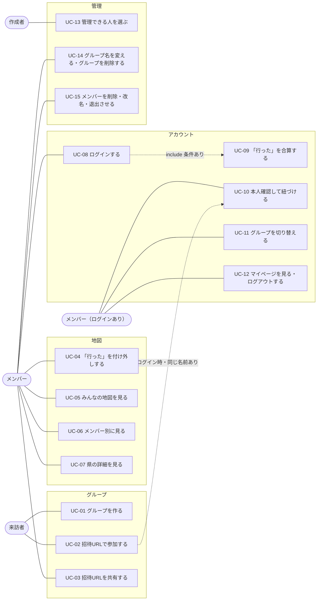

# ユースケース

状態：下書き

「誰が何をするか」を洗い出した一覧。ここから機能要件（REQ-xxx）を起こす。言葉は [用語集](glossary.md) にそろえる。元にした文章は [requirements.md](requirements.md)（たたき台）。

## アクター（登場する人）

| アクター | 説明 |
|---|---|
| 来訪者 | まだグループに入っていない人。招待URLを LINE などで受け取って開く |
| メンバー（ログインなし） | 名前だけでグループに参加している人。会員登録はしていない |
| メンバー（ログインあり） | メール＋パスワードまたは Google でログインして参加している人 |
| 作成者 | グループを作った人。ログインなし／あり、どちらでもなりうる。「管理できる人」の設定を持つ |

「メンバー（ログインなし）」と「メンバー（ログインあり）」は、ログインすると後者になる（同一人物）。以下で「メンバー」とだけ書いたら両方を指す。

## ユースケース図

UC-14・UC-15 は「管理できる人」の設定（誰でも／作成者のみ）に従う。

## ユースケース一覧

| ID | 名前 | アクター | ゴール |
|---|---|---|---|
| UC-01 | グループを作る | 来訪者 | グループ名と自分の名前を入れて、グループと招待URLを得る |
| UC-02 | 招待URLで参加する | 来訪者 | 招待URLを開き、名前を入れてグループに入る |
| UC-03 | 招待URLを共有する | メンバー | 招待URLをコピーして LINE などで友達に送る |
| UC-04 | 「行った」を付け外しする | メンバー | 地図か一覧をタップして自分の「行った」を更新する |
| UC-05 | みんなの地図を見る | メンバー | 行った人が多い県と、全員まだ行っていない県を見て次の行き先の候補を見つける |
| UC-06 | メンバー別に見る | メンバー | 選んだ人の「行った」だけを見る |
| UC-07 | 県の詳細を見る | メンバー | 県をタップして、誰が行ったかを見る |
| UC-08 | ログインする | メンバー | メール＋パスワードまたは Google でログインする（パスワードの再設定を含む） |
| UC-09 | 「行った」を合算する | メンバー（ログインあり） | ログイン時にグループとアカウントの「行った」が食い違うとき、確認して1つにする |
| UC-10 | 本人確認して紐づける | メンバー（ログインあり） | グループに同じ名前のメンバーがいるとき、自分かどうかを答えて紐づける／別の名前で入る |
| UC-11 | グループを切り替える | メンバー（ログインあり） | 参加中のグループの一覧から別のグループを開く |
| UC-12 | マイページを見る・ログアウトする | メンバー（ログインあり） | アカウントの「行った」と表示名を確認し、ログアウトする |
| UC-13 | 管理できる人を選ぶ | 作成者 | 「誰でも」か「作成者のみ」を選ぶ（「作成者のみ」はログイン済みの作成者だけ） |
| UC-14 | グループ名を変える・グループを削除する | メンバー（管理できる人） | グループ名の変更、グループの削除 |
| UC-15 | メンバーを削除・改名・退出させる | メンバー（管理できる人） | メンバーの削除、名前の変更、退出 |

## ユースケースの詳細

### UC-01 グループを作る
- 事前条件：なし（ログインなしでよい）
- 基本の流れ：トップで「グループを作る」→ グループ名と自分の名前を入力 → グループが作られ、作成者になる → 招待URLが表示される（UC-03）
- 例外：通信エラー → エラー画面

### UC-02 招待URLで参加する
- 事前条件：招待URLを知っている
- 基本の流れ：URLを開く → 名前を入力 → メンバーになり、グループの地図が開く
- 代替の流れ：
  - 端末に前回の名前が残っている → 名前を入力し直さず、そのまま開く
  - ログイン済み → 同じ名前のメンバーがいれば UC-10、いなければ新しいメンバーとして参加
  - LINE のアプリ内ブラウザで開いた → 外部ブラウザに移る
- 例外：グループがない → エラー／満員（20人）→ エラー／同じ名前がすでにある（ログインなし）→ 別の名前を求める。**同じ名前を入れた人はその人として操作できる**（信頼ベース）ので、ここでの扱いは要決定（下の「未決事項」）

### UC-03 招待URLを共有する
- 基本の流れ：招待の画面でURLをコピー（またはシェア）→ LINE に貼って送る
- 備考：再発行はしない（MVP）

### UC-04 「行った」を付け外しする
- 事前条件：メンバーである
- 基本の流れ：「わたし」で県をタップ（または一覧で選ぶ）→ 付け外しされ、保存される
- 備考：ログインなしならグループのメンバーごとに保存し、そのグループの誰でも編集できる。ログインありならアカウントに保存して全グループに同期し、本人しか編集できない

### UC-05 みんなの地図を見る／UC-06 メンバー別に見る／UC-07 県の詳細を見る
- 「みんな」：行った人が多い県ほど濃く塗り、全員まだ行っていない県を強調する
- 「メンバー別」：選んだ1人の「行った」だけを表示する
- 県をタップ：その県に行った人の一覧を見る
- 備考：他の人の変更は、画面を開いたときに反映されればよい

### UC-08 ログインする
- 基本の流れ：ログインを選ぶ → メール＋パスワードまたは Google → ログイン済みになる
- 分岐：ログインなしで参加していたグループから来た場合、データの扱いは UC-09
- 例外：パスワードを忘れた → 再設定／LINE のアプリ内ブラウザ → 外部ブラウザの案内（Google ログインが使えないため）

### UC-09 「行った」を合算する
- 事前条件：ログインなしで参加していた人がログインした
- 流れ：グループの「行った」（G）とアカウントの「行った」（U）を比べる
  - U が空 → 確認なしで G をアカウントに引き継ぐ
  - G が U にすべて含まれる → 確認なしで U を表示
  - それ以外 → 「アカウントのデータを使う」（G は破棄）か「合算する」（G と U を合わせる）を選ぶ
- 備考：合算すると参加中の他のグループにも反映される

### UC-10 本人確認して紐づける
- 事前条件：ログイン済みの人が、同じ名前のメンバー（まだ誰のアカウントとも紐づいていない）がいるグループに入る
- 流れ：「この人はあなたですか？」→ はい：紐づけ、データは UC-09 と同じ扱い／いいえ：別の名前を入力
- 注意：実際には本人かどうかを確かめていない（自己申告）。他人のメンバーを先に紐づけられるリスクがある（[用語集の残りの指摘](glossary.md)）

### UC-11 グループを切り替える／UC-12 マイページ
- UC-11：ログイン中のグループ一覧から選んで開く。新しいグループを作る（UC-01）こともできる
- UC-12：アカウントの「行った」と表示名を見る。ログアウトする

### UC-13〜15 管理
- UC-13：作成者が、管理できる人を「誰でも」（初期値）か「作成者のみ」に切り替える。「作成者のみ」にできるのはログイン済みの作成者だけ
- UC-14：グループ名の変更、グループの削除。管理できる人だけができる
- UC-15：メンバーの削除、名前の変更、退出。メンバーを削除してもアカウントの「行った」は消えない

## 未決事項

- ログインなしで、すでにあるメンバーと同じ名前を入れたとき、「その人として入る」のか「別の名前を求める」のか（requirements.md は「名前がそのまま本人」かつ「名前は重複させない」としている）
- 退出したメンバーの「行った」をグループに残すか、消すか
- グループを削除したとき、ログインありメンバーのアカウントの「行った」は残る（要件どおり）。メンバーへの通知はするか
- 作成者がログインなしのまま別の端末に移ったとき、作成者であり続けられるか（用語集の重大指摘「作成者が名前か `uid` か」と同じ論点）
